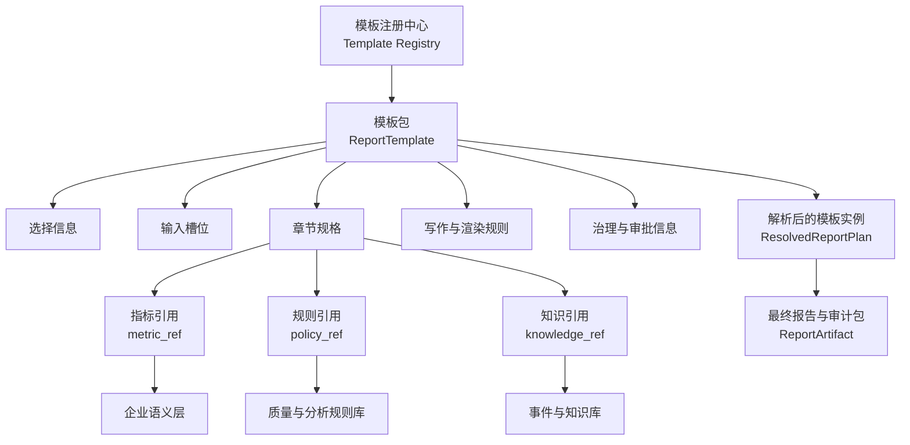
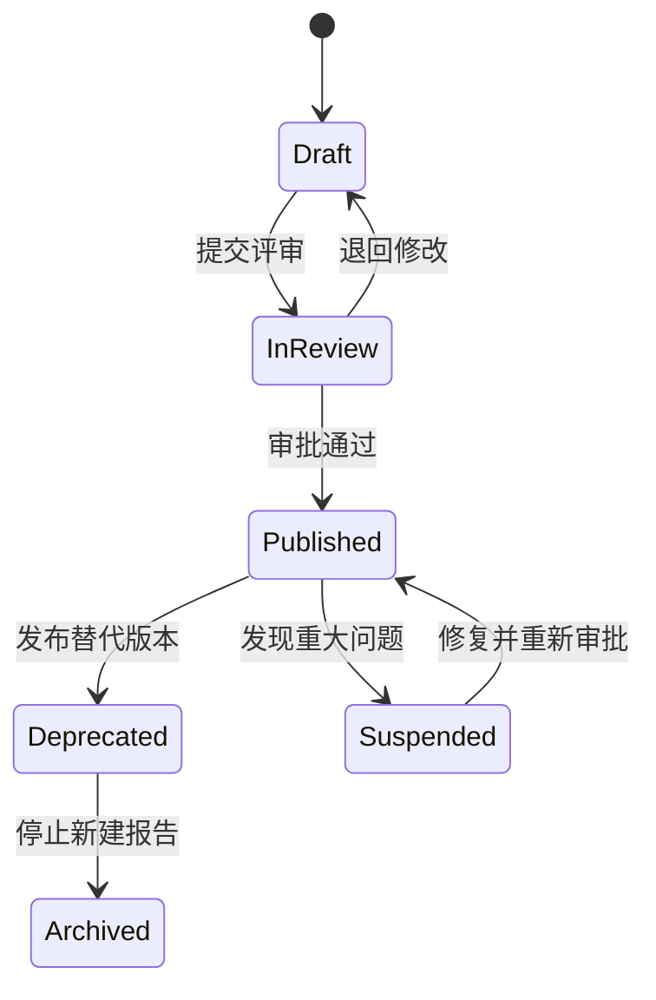

# 企业报告模板库：概念、结构与具体案例

> 本文是 [ideaV2.md](ideaV2.md) 中“企业报告模板库”部分的细化设计，重点回答：模板到底是什么、保存什么、如何运行，以及一份可落地的模板具体长什么样。

## 一、先给出一个明确的定义

**企业报告模板不是一份 Word 空白文档，也不是一段大模型 Prompt。**

它是一份经过业务、数据和合规人员共同审批的、可版本化的**报告生产蓝图（Report Production Blueprint）**。它用机器可读的方式规定：

- 什么情况下应选择这类报告；
- 生成报告前必须收集哪些参数；
- 报告由哪些章节组成；
- 每个章节需要回答什么业务问题；
- 每个章节允许引用哪些指标和分析规则；
- 数据缺失、异常或证据不足时如何处理；
- 文字、图表、引用和审批必须遵守什么规则；
- 最终应该交付哪些文件和审计信息。

一句话概括：

> 企业报告模板是连接“业务报告规范”和“自动化执行流程”的配置合同。

## 二、模板、模板实例和最终报告的区别

这是理解模板库最关键的一点。

| 对象 | 含义 | 是否包含真实业务数据 | 示例 |
| --- | --- | --- | --- |
| 模板定义 `ReportTemplate` | 某类报告长期稳定的生产规则 | 否 | “研发效能周报模板 v2.1.0” |
| 模板实例 `ResolvedReportPlan` | 本次运行已经填充参数的执行计划 | 只包含查询参数，不包含查询结果 | “平台研发部 2026 年第 26 周周报计划” |
| 最终报告 `ReportArtifact` | 查询、分析、撰写和审批后的交付物 | 是 | “平台研发部 2026 年第 26 周研发效能周报” |

例如，模板中可以写：

```yaml
period_slot: report_week
metric_ref: deployment_success_rate
comparison: previous_period
```

但模板中不能写：

```yaml
report_week: 2026-W26
deployment_success_rate: 94.8%
```

后者属于某次运行产生的模板实例和事实数据，不属于可复用模板。

## 三、模板库不是什么

为了避免职责不断膨胀，模板库应明确排除以下内容：

- **不是指标定义库：** 指标公式、聚合方式、Join 路径和权限属于企业语义层；模板只引用 `metric_id`。
- **不是 SQL 仓库：** SQL 由语义层和 NL2MQL2SQL 在运行时生成；模板不应硬编码生产 SQL。
- **不是业务数据仓库：** 模板不保存具体日期、地区、部门或指标值。
- **不是纯 Prompt 仓库：** Prompt 是实现手段，模板描述的是业务目标、约束和验收规则。
- **不是历史报告归档库：** 历史报告可以作为 Few-Shot 样例，但正式交付物应进入报告归档系统。
- **不是规则全集：** 数据质量阈值、异常规则和合规策略由规则库管理，模板通过 `policy_ref` 绑定。

## 四、一个模板具体由什么组成

一份完整模板可以拆成六层。

### 1. 选择信息（Selection Metadata）

用于回答“什么情况下选择这个模板”：

- 报告类型：周报、月报、专项分析、风险报告；
- 业务域：研发效能、账户运营、资金交易、客户服务；
- 目标读者：项目负责人、管理层、客户、监管或审计人员；
- 时间频率：周、月、季、按事件触发；
- 适用组织、地区、产品和数据成熟度；
- 支持的输出格式与密级。

### 2. 输入槽位（Input Slots）

用于回答“生成前必须知道什么”：

- 统计周期；
- 目标组织或业务范围；
- 对比周期；
- 报告接收人；
- 重点关注主题；
- 输出语言、密级和签发方式。

每个槽位必须定义类型、是否必填、允许值、默认策略和校验规则，而不是只在 Prompt 中描述。

### 3. 内容蓝图（Content Blueprint）

用于回答“报告要讲什么”：

- 章节顺序和层级；
- 必选章节、可选章节和条件章节；
- 每章的业务目标和必须回答的问题；
- 每章允许使用的指标、事件和证据类型；
- 每章期望的文字长度、语气和图表类型；
- 空数据、部分数据和异常数据的展示策略。

### 4. 数据与分析绑定（Data and Analysis Binding）

用于回答“每章需要什么数据、如何分析”：

- 引用的 `metric_id`；
- 需要的维度、时间粒度和比较方式；
- 数据质量策略 `quality_policy_ref`；
- 异常检测策略 `analysis_policy_ref`；
- 允许使用的知识库集合；
- 事实和原因结论的证据等级要求。

### 5. 表达与渲染规则（Writing and Rendering）

用于回答“结果如何呈现”：

- 标题命名规则；
- 正式程度、语气和禁用表达；
- 数字精度、百分比和单位格式；
- 图表主题、颜色语义和表格格式；
- Markdown、HTML、PDF 等输出要求；
- 数据引用在正文、脚注和证据面板中的展示方式。

### 6. 治理信息（Governance）

用于回答“谁负责、如何发布”：

- 模板所有者、业务审批人和数据负责人；
- 版本、状态、生效时间和废止时间；
- 变更说明和评审记录；
- 使用权限和适用密级；
- 发布前必须通过的测试；
- 最终报告的审批流程。

## 五、模板库的对象关系



模板库是控制中心，但不是所有资产的物理存储位置。模板通过稳定 ID 和版本引用语义层、规则库和知识库，从而避免多处重复定义同一指标或规则。

## 六、推荐的模板包结构

模板可以保存在 Git、数据库或配置中心。即使最终存入数据库，也建议先按下面的逻辑结构管理：

```text
report-templates/
└── engineering-efficiency-weekly/
    └── 2.1.0/
        ├── template.yaml
        ├── sections/
        │   ├── executive-summary.md
        │   ├── delivery-efficiency.md
        │   ├── quality-stability.md
        │   └── risks-actions.md
        ├── examples/
        │   ├── good-example.md
        │   └── prohibited-example.md
        ├── styles/
        │   └── management-report.yaml
        ├── tests/
        │   ├── normal-case.yaml
        │   ├── missing-slot.yaml
        │   ├── empty-data.yaml
        │   └── permission-denied.yaml
        └── CHANGELOG.md
```

其中：

- `template.yaml` 是机器可读的主定义；
- `sections/` 保存章节写作规范，不保存实际正文；
- `examples/` 提供允许和禁止的表达示例；
- `styles/` 定义渲染规则；
- `tests/` 定义模板发布前必须通过的测试；
- `CHANGELOG.md` 记录模板变更原因。

## 七、完整案例：研发效能周报模板

### 1. 使用场景

假设用户输入：

> 请生成平台研发部 2026 年第 26 周研发效能周报，面向研发管理层，对比第 25 周，重点关注发布稳定性。

系统需要生成一份包括交付效率、质量稳定性、重点异常和下周行动的正式周报。

模板在设计时并不知道“平台研发部”“2026 年第 26 周”和实际指标值，只知道这种报告需要哪些参数、章节和数据。

### 2. 模板依赖的外部资产

在模板发布前，企业语义层至少应存在以下指标：

| 指标 ID | 业务含义 | 单位 | 常用维度 |
| --- | --- | --- | --- |
| `deployment_count` | 统计周期内生产发布次数 | 次 | 团队、应用 |
| `requirements_completed_count` | 统计周期内完成的需求数量 | 个 | 团队、项目 |
| `change_lead_time_hours` | 变更从提交到生产完成的平均时长 | 小时 | 团队、应用 |
| `deployment_success_rate` | 成功发布次数占全部发布次数的比例 | % | 团队、应用 |
| `change_failure_rate` | 引发回滚或故障的变更占全部变更比例 | % | 团队、应用 |
| `production_incident_count` | 生产故障数量 | 起 | 团队、等级 |
| `mttr_minutes` | 生产故障平均恢复时间 | 分钟 | 团队、等级 |
| `open_high_risk_count` | 未关闭的高风险事项数量 | 项 | 团队、责任人 |

规则库至少应存在：

```yaml
id: engineering.weekly.delivery-risk
version: 1.3.0
rules:
  - id: deployment_success_rate_drop
    when: change_pp(deployment_success_rate) <= -2
    severity: warning
  - id: change_failure_rate_rise
    when: change_pp(change_failure_rate) >= 2
    severity: warning
  - id: p1_incident_exists
    when: production_incident_count{severity="P1"} > 0
    severity: critical
  - id: mttr_deterioration
    when: relative_change(mttr_minutes) >= 0.15
    severity: warning
```

这里的阈值位于独立规则库中。模板只决定本报告采用哪一套规则，规则更新无需复制修改所有模板。

### 3. 可执行模板定义

下面是一份经过适度精简、但已经可以指导实现的模板案例。

```yaml
apiVersion: report.ai/v1
kind: ReportTemplate

metadata:
  template_id: engineering-efficiency-weekly
  name: 研发效能周报
  version: 2.1.0
  status: published
  owner: engineering-productivity-office
  effective_from: 2026-06-01
  confidentiality: internal
  description: 面向研发管理层的团队级研发效能与稳定性周报。

selection:
  report_types: [engineering_efficiency]
  domains: [software_delivery]
  frequencies: [weekly]
  audiences: [engineering_management]
  supported_outputs: [markdown, html, pdf]
  required_capabilities:
    - semantic_metrics
    - weekly_comparison
    - evidence_audit

slots:
  - id: target_org
    label: 统计组织
    type: organization_ref
    required: true
    allowed_levels: [department, team]

  - id: report_week
    label: 报告周
    type: iso_week
    required: true

  - id: comparison_week
    label: 对比周
    type: iso_week
    required: true
    default:
      strategy: previous_period
      based_on: report_week

  - id: audience
    label: 目标读者
    type: enum
    required: true
    allowed_values: [engineering_management, project_management]
    default: engineering_management

  - id: focus_topics
    label: 重点关注主题
    type: string_list
    required: false
    allowed_values: [delivery_speed, release_stability, incidents, risks]

title:
  pattern: "{{ target_org.name }} {{ report_week }} 研发效能周报"

sections:
  - id: executive_summary
    title: 核心结论
    order: 10
    required: true
    objective: 用三至五条结论概括本周交付、质量、异常和风险。
    questions:
      - 本周整体交付表现是改善、持平还是下降？
      - 最值得管理层关注的质量变化是什么？
      - 是否存在需要立即处理的重大风险？
    inputs:
      fact_groups: [delivery_overview, stability_overview, risk_overview]
    writing:
      format: bullet_list
      max_items: 5
      max_chars: 500
      tone: formal_concise
    evidence:
      quantitative_claims: required
      causal_claims: prohibited
    charts: []

  - id: delivery_efficiency
    title: 交付效率
    order: 20
    required: true
    objective: 展示交付规模、完成情况和交付周期变化。
    data_requirements:
      - ref_id: delivery_count
        metric_ref: deployment_count
        period: "{{ report_week }}"
        compare_to: "{{ comparison_week }}"
        dimensions: [team]
      - ref_id: completed_requirements
        metric_ref: requirements_completed_count
        period: "{{ report_week }}"
        compare_to: "{{ comparison_week }}"
        dimensions: [team]
      - ref_id: lead_time
        metric_ref: change_lead_time_hours
        period: "{{ report_week }}"
        compare_to: "{{ comparison_week }}"
        dimensions: [team]
    analysis:
      methods: [period_comparison, trend_direction]
      policy_ref: engineering.weekly.delivery-risk@1.3.0
    writing:
      structure:
        - current_performance
        - comparison
        - management_interpretation
      tone: formal_analytical
      max_chars: 900
    chart:
      type: combo_bar_line
      category: team
      series: [deployment_count, change_lead_time_hours]
      fallback: table
    empty_data_strategy: block_section

  - id: quality_stability
    title: 质量与稳定性
    order: 30
    required: true
    objective: 评估发布质量、生产故障和恢复效率。
    data_requirements:
      - ref_id: deployment_success
        metric_ref: deployment_success_rate
        period: "{{ report_week }}"
        compare_to: "{{ comparison_week }}"
        dimensions: [team]
      - ref_id: change_failure
        metric_ref: change_failure_rate
        period: "{{ report_week }}"
        compare_to: "{{ comparison_week }}"
        dimensions: [team]
      - ref_id: incidents
        metric_ref: production_incident_count
        period: "{{ report_week }}"
        compare_to: "{{ comparison_week }}"
        dimensions: [severity]
      - ref_id: recovery_time
        metric_ref: mttr_minutes
        period: "{{ report_week }}"
        compare_to: "{{ comparison_week }}"
        dimensions: [severity]
    analysis:
      methods: [period_comparison, threshold_check, anomaly_detection]
      policy_ref: engineering.weekly.delivery-risk@1.3.0
      knowledge_ref: engineering-change-and-incident-events
      attribution_max_level: hypothesis
    writing:
      structure:
        - observed_facts
        - detected_anomalies
        - possible_explanations
      required_phrasing_for_hypothesis: [可能, 初步判断, 尚需验证]
      tone: formal_risk_aware
      max_chars: 1200
    chart:
      type: line
      series: [deployment_success_rate, change_failure_rate]
      fallback: table
    empty_data_strategy: block_report

  - id: incident_details
    title: 重点故障复盘
    order: 40
    required: false
    include_when:
      expression: >
        production_incident_count{severity in ["P1", "P2"]} > 0
      evaluate_after: data_quality_passed
    objective: 列出本周 P1/P2 故障及经过确认的影响和改进项。
    knowledge_ref: engineering-change-and-incident-events
    evidence:
      event_source: required
      owner: required
      causal_claims: human_confirmation_required
    writing:
      format: incident_table
      columns: [事件, 等级, 影响, 恢复时长, 初步原因, 责任人, 状态]
    empty_data_strategy: omit_section

  - id: risks_actions
    title: 风险与下周行动
    order: 50
    required: true
    objective: 形成具备责任人和截止时间的风险及行动清单。
    data_requirements:
      - ref_id: open_risks
        metric_ref: open_high_risk_count
        period: "{{ report_week }}"
        dimensions: [owner]
    action_item_schema:
      required_fields: [action, owner, due_date, source_ref]
    writing:
      format: action_table
      prohibit_unassigned_actions: true
      tone: direct_accountable
    empty_data_strategy: render_no_open_risk_statement

global_writing_policy:
  language: zh-CN
  style: enterprise_formal
  avoid_marketing_language: true
  prohibit_absolute_claims: true
  percentage_change_display:
    rate_metric: percentage_point
    count_metric: relative_percent
  number_precision:
    percent: 1
    hours: 1
    minutes: 0

evidence_policy:
  quantitative_claim_evidence: required
  ranking_claim_evidence: required
  trend_claim_evidence: required
  unsupported_claim_action: block
  expose_refs_in_delivery_text: false
  expose_refs_in_evidence_panel: true

quality_policy:
  policy_ref: engineering.weekly.data-quality@1.2.0
  critical_failure_action: block_report
  warning_action: annotate_and_continue

approval:
  outline_review:
    role: engineering_operations_manager
    required: true
  final_review:
    role: engineering_department_owner
    required: true
  additional_review_when:
    - condition: contains_p1_incident
      role: production_safety_owner

delivery:
  outputs: [report.md, charts.json, evidence.json, audit.json]
  archive_policy: internal-report-3y
```

### 4. 这份模板真正控制了什么

以上模板不是给模型看的长 Prompt，而是被不同程序分别消费：

| 模板内容 | 消费者 | 作用 |
| --- | --- | --- |
| `selection` | 模板选择器 | 判断是否适用于本次需求 |
| `slots` | 需求受理服务 | 收集和校验运行参数 |
| `sections` | Planner | 生成受约束的大纲和章节计划 |
| `data_requirements` | 语义解析服务 | 生成结构化查询规约 |
| `analysis` | Analyst | 选择统计方法和异常规则 |
| `writing` | Writer | 控制章节目标、结构和篇幅 |
| `evidence_policy` | Auditor | 判断哪些陈述必须绑定证据 |
| `approval` | 工作流引擎 | 设置人工确认节点 |
| `delivery` | 渲染与归档服务 | 生成并保存交付物 |

同一字段只有一个明确的执行责任方，避免多个 Agent 对同一规则作不同解释。

## 八、模板在一次真实运行中如何变化

### 1. 槽位填充后的模板实例

用户需求经过解析和确认后，形成以下实例：

```yaml
kind: ResolvedReportPlan
report_run_id: report_run_2026w26_platform
template:
  template_id: engineering-efficiency-weekly
  version: 2.1.0
resolved_slots:
  target_org:
    id: org_platform_engineering
    name: 平台研发部
  report_week: 2026-W26
  comparison_week: 2026-W25
  audience: engineering_management
  focus_topics: [release_stability]
resolved_sections:
  - executive_summary
  - delivery_efficiency
  - quality_stability
  - incident_details
  - risks_actions
bound_versions:
  semantic_layer: 3.2.0
  delivery_risk_policy: 1.3.0
  data_quality_policy: 1.2.0
approval:
  outline_status: approved
  approved_by: user_1038
```

此时系统已经知道要生成哪份报告、查什么范围的数据，但还没有任何指标结果。

### 2. 查询后形成的事实数据

假设数据查询和质量校验后得到以下事实：

| 指标 | 第 26 周 | 第 25 周 | 变化 | 证据 ID |
| --- | ---: | ---: | ---: | --- |
| 生产发布次数 | 42 次 | 38 次 | +10.5% | `fact_deploy_count` |
| 完成需求数 | 31 个 | 29 个 | +6.9% | `fact_req_completed` |
| 平均变更前置时间 | 18.4 小时 | 21.2 小时 | -13.2% | `fact_lead_time` |
| 发布成功率 | 94.8% | 97.6% | -2.8 个百分点 | `fact_success_rate` |
| 变更失败率 | 5.2% | 2.4% | +2.8 个百分点 | `fact_failure_rate` |
| P1/P2 故障数 | 0/2 起 | 0/1 起 | P2 增加 1 起 | `fact_incidents` |
| 平均恢复时间 | 46 分钟 | 39 分钟 | +17.9% | `fact_mttr` |

规则引擎由此触发：

- `deployment_success_rate_drop`：命中；
- `change_failure_rate_rise`：命中；
- `mttr_deterioration`：命中；
- `incident_details.include_when`：为真，因此保留“重点故障复盘”章节。

### 3. Writer 接收到的不是整张原始表

Writer 接收到的是按章节裁剪后的事实包，例如：

```yaml
section_id: quality_stability
objective: 评估发布质量、生产故障和恢复效率。
facts:
  - id: fact_success_rate
    statement: 发布成功率为 94.8%，较上周下降 2.8 个百分点。
  - id: fact_failure_rate
    statement: 变更失败率为 5.2%，较上周上升 2.8 个百分点。
  - id: fact_incidents
    statement: 本周发生 2 起 P2 故障，较上周增加 1 起。
  - id: fact_mttr
    statement: 平均恢复时间为 46 分钟，较上周增加 17.9%。
anomalies:
  - rule_id: deployment_success_rate_drop
    severity: warning
  - rule_id: change_failure_rate_rise
    severity: warning
  - rule_id: mttr_deterioration
    severity: warning
allowed_attribution_level: hypothesis
writing_constraints:
  required_phrasing_for_hypothesis: [可能, 初步判断, 尚需验证]
  max_chars: 1200
```

这样可以避免 Writer 接触无关数据，也避免它自行计算百分比或创造没有来源的指标。

### 4. 按模板生成的报告片段

最终章节可能呈现为：

```markdown
## 质量与稳定性

本周发布成功率为 94.8%，较上周下降 2.8 个百分点；变更失败率为 5.2%，较上周上升 2.8 个百分点。两项指标均触发稳定性预警，表明在发布规模增长的同时，变更质量出现阶段性波动。

本周共发生 2 起 P2 故障，较上周增加 1 起，平均恢复时间由 39 分钟上升至 46 分钟。结合故障记录，稳定性下降可能与本周两次重点变更有关，具体原因仍需在故障复盘完成后确认。
```

交付正文可以不显示内部证据标签，但证据面板应保存：

```yaml
claims:
  - claim: 本周发布成功率为 94.8%。
    evidence_refs: [fact_success_rate]
    audit_status: passed
  - claim: 稳定性下降可能与本周两次重点变更有关。
    evidence_refs: [fact_incidents, event_change_101, event_change_102]
    attribution_level: hypothesis
    audit_status: passed
```

这就是模板、事实层和写作节点之间的实际配合方式。

## 九、第二个案例：账户运行月报模板

“账户运行月报”与“研发效能周报”使用同一套模板机制，但章节、槽位、指标和审批要求不同。

### 1. 典型用户需求

> 生成华东区域 2026 年 6 月账户运行月报，面向运营管理层，重点关注休眠账户和大额交易变化。

### 2. 精简模板定义

```yaml
metadata:
  template_id: account-operation-monthly
  name: 账户运行月报
  version: 1.4.0
  status: published
  confidentiality: confidential

selection:
  report_types: [account_operation]
  domains: [account, transaction]
  frequencies: [monthly]
  audiences: [operations_management]

slots:
  - id: target_region
    type: region_ref
    required: true
  - id: report_month
    type: year_month
    required: true
  - id: comparison_month
    type: year_month
    default: {strategy: previous_period, based_on: report_month}
  - id: account_scope
    type: account_scope_ref
    required: true

sections:
  - id: operation_overview
    title: 运行概览
    required: true
    metric_refs:
      - total_account_count
      - active_account_count
      - new_account_count
      - closed_account_count

  - id: activity_analysis
    title: 账户活跃度分析
    required: true
    metric_refs:
      - active_account_rate
      - dormant_account_count
      - dormant_account_rate
    dimensions: [customer_type, account_type]

  - id: transaction_analysis
    title: 交易运行分析
    required: true
    metric_refs:
      - transaction_count
      - transaction_amount
      - large_transaction_count
      - large_transaction_amount
    policy_ref: account.monthly.transaction-monitoring@2.0.0

  - id: risk_events
    title: 风险与异常事项
    required: true
    metric_refs:
      - anomaly_alert_count
      - unresolved_alert_count
    knowledge_ref: account-risk-event-records
    causal_claims: human_confirmation_required

  - id: recommendations
    title: 后续建议
    required: true
    action_item_schema:
      required_fields: [action, owner, due_date, source_ref]

approval:
  outline_review: operations_manager
  final_review: account_business_owner
  additional_review_when:
    - condition: contains_sensitive_customer_data
      role: data_compliance_owner
```

### 3. 模板与语义层的职责边界

模板只声明需要“大额交易数量”指标：

```yaml
metric_ref: large_transaction_count
```

至于“大额”的具体定义是单笔超过 50 万元、100 万元，还是根据客户等级动态确定，应由企业语义层和政策规则定义：

```yaml
metric_id: large_transaction_count
definition: 满足当前生效的大额交易政策条件的交易笔数
policy_ref: transaction.large-amount-definition@2026.06
```

因此，当企业调整大额交易口径时，只需发布新的政策或指标版本，不必逐份修改月报模板。报告运行时必须绑定当期生效版本，历史报告仍可复现原口径。

## 十、模板复用不等于复制粘贴

当模板数量增加后，可以采用有限的分层复用：

```text
企业正式报告基础模板
    ├── 研发管理报告基础模板
    │   ├── 研发效能周报
    │   └── 研发效能月报
    └── 运营管理报告基础模板
        ├── 账户运行月报
        └── 交易运营月报
```

### 1. 基础模板可定义

- 企业统一标题和文号规则；
- 通用数字、日期和单位格式；
- 密级、水印和页眉页脚；
- 通用证据要求；
- 通用审批和归档要求；
- 全局禁用表达。

### 2. 场景模板负责定义

- 业务章节；
- 指标和维度引用；
- 场景分析规则；
- 条件章节；
- 业务审批角色。

### 3. 租户或部门覆盖层只允许修改

- 品牌和展示信息；
- 允许的可选章节；
- 更严格的审批要求；
- 不影响指标含义的展示偏好。

不建议允许部门覆盖指标公式、数据权限或证据规则，否则会重新造成口径分裂。模板继承层级也不宜过深，MVP 阶段可以不做继承，待出现三份以上真实重复模板后再抽取基础模板。

## 十一、模板选择与解析流程

### 1. 模板选择输入

```yaml
report_type: engineering_efficiency
domain: software_delivery
frequency: weekly
audience: engineering_management
target_org: org_platform_engineering
requested_output: markdown
```

### 2. 模板选择规则

模板选择器首先执行确定性过滤：

1. 模板状态必须为 `published`；
2. 报告类型、业务域、频率和输出格式必须匹配；
3. 用户必须有权使用该模板和相关数据域；
4. 模板依赖的指标、规则和知识源版本必须可用；
5. 多个模板同时匹配时，再由规则分数或 LLM 给出候选解释；
6. 仍无法唯一选择时，由用户确认，不自动猜测。

### 3. 模板解析输出

解析器应输出结构化 `ResolvedReportPlan`，而不是直接输出自然语言大纲。至少包含：

- 绑定的模板和依赖版本；
- 完整槽位值；
- 本次启用的章节；
- 每章的 `MetricQuerySpec`；
- 质量、分析、写作和证据策略；
- 人工审批节点；
- 预计查询数量、成本等级和输出产物。

## 十二、模板生命周期与治理

### 1. 状态流转



只有 `Published` 状态的模板允许新建正式报告。已开始运行的报告必须继续绑定原模板版本，不能在中途静默切换。

### 2. 版本规则

建议采用语义化版本：

- **Major：** 删除章节、改变必填槽位或修改产物合同等不兼容变化；
- **Minor：** 新增可选章节、可选指标或新的输出格式；
- **Patch：** 文案、样例和不影响执行合同的样式修复。

发布后的模板版本原则上不可原地修改。紧急问题通过暂停版本并发布新版本处理。

### 3. 责任角色

| 角色 | 职责 |
| --- | --- |
| 模板所有者 | 对模板适用范围和章节结构负责 |
| 业务专家 | 对报告问题、表达方式和业务价值负责 |
| 指标负责人 | 对被引用指标的定义和数据质量负责 |
| 合规/安全人员 | 对权限、敏感信息和审批规则负责 |
| 平台管理员 | 对 Schema、版本、发布和运行兼容性负责 |

## 十三、模板发布前如何测试

模板是可执行配置，因此必须像代码一样测试。

### 1. 结构测试

- YAML/JSON 是否符合 `ReportTemplate` Schema；
- `template_id + version` 是否唯一；
- 必选章节、槽位和审批节点是否完整；
- 章节顺序、引用和条件表达式是否合法。

### 2. 依赖测试

- 所有 `metric_ref` 是否存在且状态可用；
- 指标是否支持模板要求的维度和时间粒度；
- 所有 `policy_ref`、`knowledge_ref` 和样式引用是否可解析；
- 模板密级是否与数据等级和输出渠道兼容。

### 3. 场景测试

- 正常输入能否生成稳定的 `ResolvedReportPlan`；
- 缺失必填槽位时是否阻断；
- 空数据、部分数据和迟到数据是否按策略处理；
- 无权限用户是否无法解析和执行模板；
- 条件章节是否在正确条件下启用或省略；
- 数字、趋势和原因陈述是否执行正确证据策略。

### 4. 回归测试

- 使用固定事实包生成报告快照，比较章节、图表和证据变化；
- 新模板版本与上一版本并行运行，分析差异；
- 更换模型或 Prompt 后重新执行所有模板测试；
- 对历史人工驳回案例建立长期回归集。

## 十四、MVP 中模板库应该做到什么程度

第一阶段不需要建设一个庞大的“企业模板商城”。建议只实现一份真正可运行的模板。

### MVP 建议范围

- 1 个模板：研发效能周报；
- 4～5 个章节；
- 10～20 个已治理指标；
- 2 个固定人工审批节点；
- Markdown 和 HTML 两种输出；
- YAML 模板定义及 JSON Schema 校验；
- 模板版本绑定、发布和停用；
- 正常、缺参、空数据、无权限和审计失败测试；
- 一份优质样例和一份禁止表达样例。

### MVP 验收标准

1. 同一模板和同一组参数能够生成结构一致的执行计划；
2. 模板引用的指标和规则 100% 可解析；
3. 缺失必填槽位时不会发起查询；
4. 条件章节启停结果可解释、可测试；
5. 每个量化结论都能回溯到事实对象；
6. 模板、语义和规则版本能够随报告归档；
7. 模板升级不会改变历史报告的复现结果；
8. 业务人员能够在不修改程序代码的情况下调整章节和展示规则。

## 十五、与 V2 总体架构的关系

企业报告模板库在系统中承担的是“生产蓝图”角色：

```text
用户需求
  -> 模板库决定报告结构和所需参数
  -> 企业语义层解释指标和数据关系
  -> 规则库执行质量与异常判断
  -> NL2MQL2SQL 获取真实数据
  -> 事实与证据层形成可引用事实
  -> Writer 按模板写作
  -> Auditor 按模板的证据规则审计
  -> 工作流按模板的审批规则发布
```

因此，模板库既不是简单的文档集合，也不应成为包含所有业务逻辑的巨大配置文件。它应稳定描述报告的目的、结构、依赖和约束，并通过版本化引用与其他治理资产协同。

## 十六、结论

一个真正可落地的企业报告模板，至少应回答六个问题：

1. **何时使用：** 适用什么报告类型、业务域和读者；
2. **需要什么：** 必须收集哪些运行参数；
3. **报告讲什么：** 包含哪些章节和管理问题；
4. **依据是什么：** 引用哪些指标、规则和证据；
5. **如何表达：** 使用什么结构、语气、图表和引用方式；
6. **如何负责：** 谁审批、如何测试、怎样版本化和归档。

对于当前项目，最合适的起点不是先建设大量抽象模板，而是把“研发效能周报”做成第一份完整模板，连通槽位、指标、查询、事实、写作、审计和审批。等第一份模板稳定运行后，再从真实重复需求中抽取公共能力，模板库的边界会自然清晰起来。
