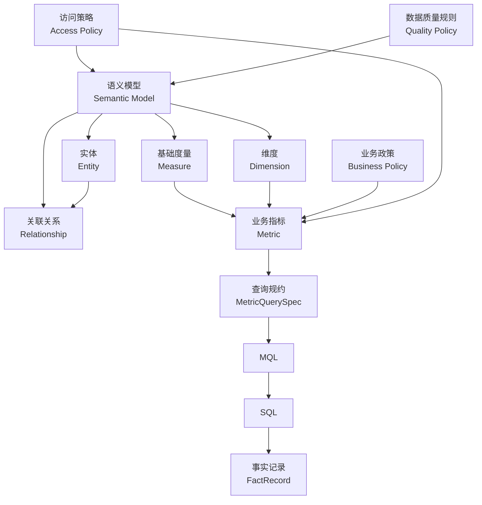

# 企业语义层：概念、模型与具体案例

> 本文是 [ideaV2.md](ideaV2.md) 中“企业语义层”部分的细化设计，并与 [企业报告模板库](ideaV2-企业报告模版库.md) 配套使用。本文重点回答：语义层到底管理什么、如何连接现有 NL2MQL2SQL，以及一套真实指标定义如何从自然语言运行到 SQL 和事实记录。

## 一、先给出一个明确的定义

**企业语义层（Enterprise Semantic Layer）是一套将业务语言稳定映射为数据查询语义的、可治理且可执行的中间层。**

它统一定义：

- 企业中的业务对象是什么，例如账户、客户、应用、团队、发布和故障；
- 指标是什么意思、如何计算、使用什么单位；
- 指标允许按哪些维度拆分；
- 不同数据模型之间可以通过什么关系关联；
- “本周”“上月”“同比”等时间概念如何解释；
- 某项政策、口径或权限在什么时间和范围内生效；
- 哪些用户可以查看哪些指标、组织和明细；
- 一次业务请求如何转换成确定性的查询规约。

一句话概括：

> 企业语义层是业务语言与数据执行之间的受控翻译器，也是指标口径的唯一事实来源。

在本项目中，它最重要的输出不是一段自然语言，而是结构化的 `MetricQuerySpec`：

```yaml
metrics:
  - deployment_success_rate@2.1.0
dimensions:
  - application
period:
  type: iso_week
  value: 2026-W26
comparison:
  type: previous_period
filters:
  - field: organization
    operator: descendant_of
    value: org_platform_engineering
```

该规约经校验后再进入 MQL 和 SQL 生成链路。

## 二、为什么仅有“术语字典”还不够

企业自然语言至少存在五类歧义。

### 1. 同一个词可能对应多个指标

用户说“交易额”，可能指：

- 原始交易金额；
- 去除撤销后的有效交易金额；
- 清算完成金额；
- 折算为人民币后的交易金额。

仅保存“交易额 = transaction_amount”无法判断用户真正需要哪一个指标。

### 2. 同一个指标可能有多个合法口径

“活跃账户”可能按以下方式定义：

- 当月发生过至少一笔交易；
- 最近 30 天发生过交易；
- 登录、交易或余额变化任一行为发生；
- 不同账户类型使用不同活跃规则。

这些定义都可能在特定场景中成立，因此需要业务域、报告类型、生效时间和政策版本共同决定。

### 3. 同一张表中的字段不一定可以直接相加

订单表与订单明细表关联后，一个订单会产生多行。如果直接求订单金额总和，就可能重复计算。语义层必须知道数据粒度和 Join 基数，阻止会产生扇出（Fan-out）的错误关联。

### 4. 时间词并不天然明确

“本周”需要明确：

- 使用自然周还是滚动 7 天；
- 周一还是周日作为一周开始；
- 使用北京时间还是 UTC；
- 按事件发生时间、完成时间还是入库时间统计；
- 周期尚未结束时是否允许出正式报告。

### 5. 数据可查询不代表用户有权查看

同一个指标可能允许管理层查看团队聚合值，但不允许查看员工、客户或账户明细。权限必须在查询规划之前进入语义解析，而不能等 SQL 生成后再补救。

因此，语义层不是简单的中英文对照表，而是“业务定义 + 数据模型 + 时间 + 关系 + 政策 + 权限”的组合。

## 三、企业语义层不是什么

为了保持边界清晰，企业语义层应明确排除以下职责：

- **不是数据仓库：** 它描述数据，不负责存储全部业务事实数据。
- **不是元数据目录的替代品：** 数据目录偏向发现表、字段和负责人，语义层负责可执行的业务含义。
- **不是 SQL 片段仓库：** 可以引用表达式，但不应靠复制整段 SQL 维持指标口径。
- **不是报告模板：** 模板决定报告需要哪些内容，语义层决定指标是什么意思和如何查询。
- **不是 Prompt 集合：** 同义词和说明可以帮助 LLM，但最终解析结果必须通过结构化规则校验。
- **不是权限系统本身：** 它声明和执行语义级策略，但用户身份仍来自企业 IAM 或统一认证系统。
- **不是原始数据质量平台：** 它绑定质量规则和暴露质量状态，具体校验由数据质量服务执行。

## 四、语义层与其他组件的职责边界

| 组件 | 主要回答的问题 | 示例 |
| --- | --- | --- |
| 报告模板库 | 这份报告需要讲什么 | “质量与稳定性章节需要发布成功率” |
| 企业语义层 | 指标是什么、如何切分和关联 | “发布成功率 = 成功发布数 / 总发布数” |
| NL2MQL2SQL | 如何生成并执行查询 | 将查询规约编译成 MQL 和 SQL |
| 数据质量服务 | 当前数据是否可信 | 判断数据是否完整、及时、无重复 |
| 事实与证据层 | 查询结果如何形成可引用事实 | 保存 95.2%、周期、维度和查询血缘 |
| Writer | 如何把事实写成报告 | “本周发布成功率较上周下降” |
| Auditor | 报告结论是否与证据一致 | 校验数字、单位、周期和证据引用 |

以“研发效能周报”为例：

```text
模板库：本章节需要 deployment_success_rate
语义层：定义该指标的公式、时间和允许维度
NL2MQL2SQL：生成符合定义和权限的 SQL
事实层：保存本周值、上周值、差值和血缘
Writer：使用事实生成自然语言
Auditor：检查正文是否准确引用事实
```

## 五、语义层的核心对象模型



### 1. 语义模型（Semantic Model）

语义模型描述一个具有稳定粒度的数据集合，例如：

- 一行代表一次生产发布；
- 一行代表一起生产故障；
- 一行代表一个账户在某天的快照；
- 一行代表一笔完成的交易。

每个语义模型必须声明：

- 来源数据集；
- 一行数据代表什么；
- 主键或唯一标识；
- 时间字段；
- 实体和维度；
- 可聚合的基础度量；
- 与其他模型的允许关联关系；
- 数据质量、权限和负责人。

如果连“一行代表什么”都无法准确说明，该数据集不应直接暴露给智能查询系统。

### 2. 实体（Entity）

实体是可被稳定识别和关联的业务对象，例如：

- `organization`：组织；
- `team`：团队；
- `application`：应用；
- `deployment`：发布；
- `incident`：故障；
- `customer`：客户；
- `account`：账户；
- `transaction`：交易。

实体需要定义主键、业务标识、所属层级和可见名称。用户说“平台研发部”时，实体解析服务应将它解析为稳定的 `org_id`，而不是直接将中文名称拼进 SQL。

### 3. 维度（Dimension）

维度用于分组和过滤，常见类型包括：

- **分类维度：** 应用、团队、客户类型、故障等级；
- **时间维度：** 创建时间、完成时间、快照日期；
- **地理维度：** 区域、省份、机构；
- **层级维度：** 集团、部门、团队；
- **布尔维度：** 是否成功、是否撤销、是否触发告警；
- **政策维度：** 风险等级、账户状态、交易类型。

每个指标必须明确允许使用哪些维度。不能因为底层表存在某个字段，就默认允许按该字段拆分。

### 4. 基础度量（Measure）

基础度量是靠近数据模型的聚合基础，例如：

- 发布 ID 去重计数；
- 成功发布 ID 去重计数；
- 交易金额求和；
- 故障恢复时长求和；
- 账户余额的期末值。

度量通常不直接展示给业务用户，而是用于构建业务指标。

### 5. 业务指标（Metric）

业务指标是经过治理、可以稳定对外使用的业务含义。常见类型包括：

| 类型 | 说明 | 示例 |
| --- | --- | --- |
| 简单指标 | 对一个基础度量进行聚合 | 发布次数、交易金额 |
| 比率指标 | 分子与分母的比值 | 发布成功率、活跃账户率 |
| 派生指标 | 由多个指标计算 | 人均发布次数、风险覆盖率 |
| 累计指标 | 在时间窗口内累计 | 年累计交易额 |
| 快照指标 | 取特定时间点状态 | 月末账户数、期末余额 |
| 漏斗指标 | 多阶段转化 | 需求进入、开发、验收、上线转化率 |

指标必须定义单位、格式、时间语义、允许维度、默认过滤、负责人、版本和质量要求。

### 6. 关联关系（Relationship）

关联关系不能只保存左右表和 Join Key，还必须声明基数：

- `one_to_one`；
- `many_to_one`；
- `one_to_many`；
- `many_to_many`。

语义编译器根据粒度和基数判断 Join 是否安全。对于可能造成重复计算的关系，应禁止自动 Join，或要求先聚合、使用桥接表和指定去重策略。

### 7. 业务政策（Business Policy）

业务政策描述随时间、地区、产品或客户类型变化的规则，例如：

- 什么是大额交易；
- 什么是休眠账户；
- 哪种故障属于重大故障；
- 哪些变更计入发布成功率；
- 哪些账户不进入运营统计。

政策与指标分离后，政策调整不需要复制修改所有报告模板和 Prompt。

### 8. 访问策略（Access Policy）

访问策略定义：

- 哪些角色可以查询某个指标；
- 用户可以查看哪些组织或地区；
- 是否允许明细下钻；
- 哪些字段需要脱敏；
- 小样本是否需要抑制；
- 哪些指标只能在特定报告中使用。

权限上下文必须来自可信身份系统，不能由用户在自然语言中自行声明。

## 六、推荐的语义资产结构

语义资产可以保存在 Git、数据库或配置中心。逻辑结构建议如下：

```text
semantic-layer/
├── models/
│   ├── deployment-event.yaml
│   ├── incident-event.yaml
│   ├── requirement-delivery.yaml
│   ├── account-snapshot.yaml
│   └── transaction-event.yaml
├── metrics/
│   ├── engineering-delivery.yaml
│   ├── engineering-stability.yaml
│   └── account-operation.yaml
├── entities/
│   ├── organization.yaml
│   ├── application.yaml
│   ├── customer.yaml
│   └── account.yaml
├── policies/
│   ├── large-transaction.yaml
│   ├── dormant-account.yaml
│   └── metric-access.yaml
├── tests/
│   ├── metric-golden-cases.yaml
│   ├── join-safety.yaml
│   ├── time-boundaries.yaml
│   └── permissions.yaml
└── CHANGELOG.md
```

这些文件经过校验和编译后，进入运行时语义注册中心。运行服务查询编译后的注册中心，而不是每次临时读取和解释 YAML。

## 七、完整案例一：研发效能语义模型

### 1. 业务场景

用户提出需求：

> 查询平台研发部 2026 年第 26 周的发布成功率和变更失败率，按应用拆分，并与第 25 周对比。

要正确执行该请求，系统必须明确：

- “平台研发部”对应哪个组织实体；
- “第 26 周”使用什么周历和时区；
- 哪些记录算作生产发布；
- “发布成功”如何定义；
- “变更失败”是否包括回滚和关联生产故障；
- 应用与团队之间如何关联；
- 用户是否有权查看应用级数据。

### 2. 假设的物理数据源

| 表 | 粒度 | 关键字段 |
| --- | --- | --- |
| `dwd_deployment_event` | 一行一次发布 | `deployment_id`、`application_id`、`team_id`、`completed_at`、`status`、`rollback_flag` |
| `dwd_incident_event` | 一行一起故障 | `incident_id`、`application_id`、`team_id`、`started_at`、`restored_at`、`severity` |
| `dim_application` | 一行一个应用 | `application_id`、`application_name`、`owner_team_id` |
| `dim_organization` | 一行一个组织节点 | `org_id`、`org_name`、`org_path`、`org_level` |

语义层不会把所有字段都暴露给 LLM，只暴露经过治理的实体、维度和指标。

### 3. 发布事件语义模型

```yaml
apiVersion: semantic.ai/v1
kind: SemanticModel

metadata:
  model_id: deployment_event
  name: 生产发布事件
  version: 2.3.0
  status: published
  owner: engineering-data-team
  data_classification: internal

spec:
  source:
    type: table
    name: dwd_deployment_event
    connection: engineering_warehouse

  grain:
    description: 每行代表一次进入生产环境并完成的发布尝试
    primary_key: deployment_id

  entities:
    - id: deployment
      type: primary
      expr: deployment_id
    - id: application
      type: foreign
      expr: application_id
    - id: team
      type: foreign
      expr: team_id

  dimensions:
    - id: completed_at
      type: time
      expr: completed_at
      timezone: Asia/Shanghai
      calendar: iso_8601
      supported_grains: [day, iso_week, month, quarter]

    - id: application
      type: entity
      entity_ref: application
      display_field: application.application_name

    - id: team
      type: entity
      entity_ref: team
      display_field: organization.org_name

    - id: deployment_status
      type: categorical
      expr: status
      allowed_values: [SUCCESS, FAILED, CANCELLED]

    - id: rollback_flag
      type: boolean
      expr: rollback_flag

  measures:
    - id: eligible_deployment_count
      aggregation: count_distinct
      expr: deployment_id
      filters:
        - environment = 'PRODUCTION'
        - status in ('SUCCESS', 'FAILED')

    - id: successful_deployment_count
      aggregation: count_distinct
      expr: deployment_id
      filters:
        - environment = 'PRODUCTION'
        - status = 'SUCCESS'
        - rollback_flag = false

    - id: failed_change_count
      aggregation: count_distinct
      expr: deployment_id
      filters:
        - environment = 'PRODUCTION'
        - status in ('SUCCESS', 'FAILED')
        - rollback_flag = true OR caused_incident_flag = true

    - id: lead_time_hours
      aggregation: average
      expr: timestamp_diff('hour', code_committed_at, completed_at)
      filters:
        - environment = 'PRODUCTION'
        - status = 'SUCCESS'

  relationships:
    - target_model: application
      source_entity: application
      target_entity: application
      cardinality: many_to_one
      join_type: left

    - target_model: organization
      source_entity: team
      target_entity: organization
      cardinality: many_to_one
      join_type: left

  quality_policy_ref: engineering.deployment-event-quality@1.4.0

  access_policy:
    metric_roles: [engineering_analyst, engineering_manager]
    row_scope:
      entity: team
      operator: descendant_of_user_org_scope
    raw_record_access: prohibited_for_llm
```

上例中的表达式是语义 DSL，由编译器转换为具体数据库方言。DSL 中的函数和过滤器必须来自白名单，不能执行任意代码。

### 4. 研发交付指标定义

```yaml
apiVersion: semantic.ai/v1
kind: MetricCollection

metadata:
  collection_id: engineering_delivery_metrics
  version: 2.1.0
  status: published
  owner: engineering-productivity-office

metrics:
  - metric_id: deployment_count
    name: 生产发布次数
    aliases: [发布次数, 上线次数, 生产部署次数]
    description: 统计周期内符合条件的生产发布尝试次数。
    type: simple
    model_ref: deployment_event@2.3.0
    measure: eligible_deployment_count
    time_dimension: completed_at
    unit: count
    format: integer
    allowed_dimensions: [team, application]
    default_filters: []

  - metric_id: deployment_success_rate
    name: 发布成功率
    aliases: [部署成功率, 上线成功率]
    description: 未失败且未回滚的成功生产发布占全部有效生产发布的比例。
    type: ratio
    model_ref: deployment_event@2.3.0
    numerator: successful_deployment_count
    denominator: eligible_deployment_count
    time_dimension: completed_at
    unit: percent
    format:
      precision: 1
      multiplier: 100
    allowed_dimensions: [team, application]
    null_policy: return_null
    zero_denominator_policy: return_null

  - metric_id: change_failure_rate
    name: 变更失败率
    aliases: [发布失败率, 变更故障率]
    description: 引发回滚或生产故障的发布占全部有效生产发布的比例。
    type: ratio
    model_ref: deployment_event@2.3.0
    numerator: failed_change_count
    denominator: eligible_deployment_count
    time_dimension: completed_at
    unit: percent
    format:
      precision: 1
      multiplier: 100
    allowed_dimensions: [team, application]
    null_policy: return_null
    zero_denominator_policy: return_null

  - metric_id: change_lead_time_hours
    name: 平均变更前置时间
    aliases: [交付前置时间, 变更交付周期]
    description: 从代码提交到成功完成生产发布的平均时长。
    type: simple
    model_ref: deployment_event@2.3.0
    measure: lead_time_hours
    time_dimension: completed_at
    unit: hour
    format:
      precision: 1
    allowed_dimensions: [team, application]
```

这里区分了“发布失败率”和“变更失败率”：

- “发布失败率”可以只表示发布流程执行失败；
- “变更失败率”还可能包含发布成功后引起的回滚或生产故障。

如果企业同时使用两个口径，就应定义两个不同 `metric_id`，而不是用一个指标根据 Prompt 临时改变含义。

### 5. 故障事件语义模型与指标

```yaml
apiVersion: semantic.ai/v1
kind: SemanticModel

metadata:
  model_id: incident_event
  version: 1.8.0
  status: published
  owner: production-reliability-team

spec:
  source:
    type: table
    name: dwd_incident_event
    connection: engineering_warehouse

  grain:
    description: 每行代表一起经过登记的生产故障
    primary_key: incident_id

  entities:
    - {id: incident, type: primary, expr: incident_id}
    - {id: application, type: foreign, expr: application_id}
    - {id: team, type: foreign, expr: team_id}

  dimensions:
    - id: started_at
      type: time
      expr: started_at
      timezone: Asia/Shanghai
      calendar: iso_8601
      supported_grains: [day, iso_week, month]
    - id: severity
      type: categorical
      expr: severity
      allowed_values: [P1, P2, P3, P4]
    - id: application
      type: entity
      entity_ref: application
    - id: team
      type: entity
      entity_ref: team

  measures:
    - id: incident_count
      aggregation: count_distinct
      expr: incident_id
    - id: restoration_duration_minutes
      aggregation: average
      expr: timestamp_diff('minute', started_at, restored_at)
      filters:
        - restored_at is not null

  relationships:
    - target_model: application
      source_entity: application
      target_entity: application
      cardinality: many_to_one
    - target_model: organization
      source_entity: team
      target_entity: organization
      cardinality: many_to_one

---

apiVersion: semantic.ai/v1
kind: MetricCollection

metadata:
  collection_id: engineering_incident_metrics
  version: 1.5.0
  status: published

metrics:
  - metric_id: production_incident_count
    name: 生产故障数
    type: simple
    model_ref: incident_event@1.8.0
    measure: incident_count
    time_dimension: started_at
    unit: count
    allowed_dimensions: [team, application, severity]

  - metric_id: mttr_minutes
    name: 平均恢复时间
    aliases: [MTTR, 故障平均恢复时长]
    type: simple
    model_ref: incident_event@1.8.0
    measure: restoration_duration_minutes
    time_dimension: started_at
    unit: minute
    allowed_dimensions: [team, application, severity]
```

发布事件与故障事件都是多行事实模型，不能仅凭 `application_id` 直接相互 Join，否则会形成多对多关系并重复计算。两者需要分别聚合后再按应用合并，或通过经过治理的“发布 - 故障关联桥接表”进行分析。

## 八、从自然语言到 SQL 的完整运行案例

### 1. 自然语言请求

```text
查询平台研发部 2026 年第 26 周的发布成功率和变更失败率，
按应用拆分，并与第 25 周对比。
```

### 2. 实体与术语解析

语义解析服务得到：

```yaml
resolved_entities:
  - mention: 平台研发部
    entity_type: organization
    entity_id: org_platform_engineering
    match_type: exact_business_alias

resolved_metrics:
  - mention: 发布成功率
    metric_id: deployment_success_rate
    metric_version: 2.1.0
  - mention: 变更失败率
    metric_id: change_failure_rate
    metric_version: 2.1.0

resolved_dimensions:
  - mention: 应用
    dimension_id: application

resolved_time:
  calendar: iso_8601
  timezone: Asia/Shanghai
  current_period:
    label: 2026-W26
    start: 2026-06-22T00:00:00+08:00
    end_exclusive: 2026-06-29T00:00:00+08:00
  comparison_period:
    label: 2026-W25
    start: 2026-06-15T00:00:00+08:00
    end_exclusive: 2026-06-22T00:00:00+08:00
```

### 3. 权限与兼容性检查

系统执行以下检查：

- 当前用户是否拥有 `org_platform_engineering` 范围；
- 用户角色是否允许查看应用级研发指标；
- 两个指标是否都支持 `application` 维度；
- 两个指标是否使用兼容的时间维度；
- 所需语义模型和版本是否为 `published`；
- 报告周期是否已经闭合；
- 查询预计扫描量是否在预算内。

任一硬性检查失败，都不会进入 SQL 生成。

### 4. 标准查询规约

```yaml
kind: MetricQuerySpec
spec_id: qs_engineering_2026w26_001

metrics:
  - id: deployment_success_rate
    version: 2.1.0
  - id: change_failure_rate
    version: 2.1.0

dimensions:
  - application

time:
  dimension: completed_at
  calendar: iso_8601
  timezone: Asia/Shanghai
  periods:
    - {key: current, start: 2026-06-22, end_exclusive: 2026-06-29}
    - {key: previous, start: 2026-06-15, end_exclusive: 2026-06-22}

filters:
  - entity: organization
    field: org_id
    operator: descendant_of
    value: org_platform_engineering

execution:
  result_grain: [period, application]
  max_rows: 500
  timeout_seconds: 30
  read_only: true

bound_context:
  semantic_registry_version: 3.2.0
  access_policy_version: engineering-access@1.6.0
  actor_id: user_1038
```

### 5. 示意 MQL

现有引擎的具体 MQL 语法可能不同，下面只展示结构化意图。实际项目应由适配器转换为现有 NL2MQL2SQL 接受的格式。

```yaml
query:
  from: deployment_event
  metrics:
    - deployment_success_rate
    - change_failure_rate
  group_by:
    - period
    - application
  periods:
    current: [2026-06-22, 2026-06-29)
    previous: [2026-06-15, 2026-06-22)
  where:
    organization: descendant_of(org_platform_engineering)
  semantic_versions:
    deployment_event: 2.3.0
    engineering_delivery_metrics: 2.1.0
```

### 6. 示意 SQL

```sql
WITH scoped_deployments AS (
    SELECT
        d.deployment_id,
        d.application_id,
        a.application_name,
        d.completed_at,
        d.status,
        d.rollback_flag,
        d.caused_incident_flag,
        CASE
            WHEN d.completed_at >= TIMESTAMP '2026-06-22 00:00:00+08:00'
             AND d.completed_at <  TIMESTAMP '2026-06-29 00:00:00+08:00'
                THEN 'current'
            ELSE 'previous'
        END AS period_key
    FROM dwd_deployment_event d
    JOIN dim_application a
      ON d.application_id = a.application_id
    JOIN dim_organization o
      ON d.team_id = o.org_id
    WHERE d.environment = 'PRODUCTION'
      AND d.status IN ('SUCCESS', 'FAILED')
      AND d.completed_at >= TIMESTAMP '2026-06-15 00:00:00+08:00'
      AND d.completed_at <  TIMESTAMP '2026-06-29 00:00:00+08:00'
      AND o.org_path LIKE '/engineering/platform/%'
),
aggregated AS (
    SELECT
        period_key,
        application_id,
        application_name,
        COUNT(DISTINCT deployment_id) AS eligible_deployments,
        COUNT(DISTINCT CASE
            WHEN status = 'SUCCESS' AND rollback_flag = FALSE
            THEN deployment_id END) AS successful_deployments,
        COUNT(DISTINCT CASE
            WHEN rollback_flag = TRUE OR caused_incident_flag = TRUE
            THEN deployment_id END) AS failed_changes
    FROM scoped_deployments
    GROUP BY period_key, application_id, application_name
)
SELECT
    period_key,
    application_id,
    application_name,
    100.0 * successful_deployments / NULLIF(eligible_deployments, 0)
        AS deployment_success_rate,
    100.0 * failed_changes / NULLIF(eligible_deployments, 0)
        AS change_failure_rate
FROM aggregated;
```

生产实现中，组织过滤应优先使用参数化权限谓词或组织主键集合，不应直接拼接用户输入的路径字符串。上面的 SQL 只用于说明编译结果。

### 7. 查询结果与事实记录

假设查询得到：

| 周期 | 应用 | 有效发布数 | 发布成功率 | 变更失败率 |
| --- | --- | ---: | ---: | ---: |
| 第 26 周 | 网关服务 | 20 | 95.0% | 5.0% |
| 第 26 周 | 认证服务 | 13 | 92.3% | 7.7% |
| 第 26 周 | 数据服务 | 9 | 100.0% | 0.0% |
| 第 25 周 | 网关服务 | 18 | 100.0% | 0.0% |
| 第 25 周 | 认证服务 | 12 | 91.7% | 8.3% |
| 第 25 周 | 数据服务 | 8 | 100.0% | 0.0% |

事实与证据层会将结果转换为：

```yaml
fact_id: fact_deployment_success_gateway_2026w26
metric:
  id: deployment_success_rate
  version: 2.1.0
value: 95.0
unit: percent
period:
  type: iso_week
  value: 2026-W26
dimensions:
  organization: org_platform_engineering
  application: app_gateway
query_lineage:
  query_spec_id: qs_engineering_2026w26_001
  query_run_id: query_run_9871
  sql_hash: sha256:...
  dataset_snapshot: engineering_warehouse@2026-06-29T02:00:00+08:00
quality:
  status: passed
  policy_version: engineering.deployment-event-quality@1.4.0
```

Writer 只使用这些事实对象，不重新解释指标公式，也不自行修改时间范围。

## 九、完整案例二：“大额交易”如何被准确解释

### 1. 业务问题

用户提出：

> 查询华东区域 2026 年 6 月的大额交易笔数和金额，按客户类型拆分，并与 5 月环比。

“大额交易”不是一个稳定的自然语言常量，它可能因时间、币种、客户类型和内部政策而变化。语义层需要将该概念绑定到当期生效政策。

### 2. 示例政策定义

以下仅为企业内部口径示例，不代表法规标准：

```yaml
apiVersion: semantic.ai/v1
kind: BusinessPolicy

metadata:
  policy_id: transaction.large-amount-definition
  version: 2026.06
  status: published
  owner: transaction-operations-office
  effective_from: 2026-01-01
  effective_to: 2026-06-30

spec:
  description: 单笔折算人民币金额大于等于 500,000 元的有效交易。
  base_currency: CNY
  condition:
    field: normalized_amount_cny
    operator: greater_than_or_equal
    value: 500000
  required_status: COMPLETED
  excluded_flags: [REVERSED, TEST_TRANSACTION]
  exchange_rate_policy_ref: finance.daily-closing-rate@1.2.0
```

如果 2026 年 7 月起阈值发生变化，应发布新版本，而不是覆盖 `2026.06`。6 月报告继续绑定原政策版本。

### 3. 交易语义模型中的相关定义

```yaml
apiVersion: semantic.ai/v1
kind: MetricCollection

metadata:
  collection_id: account_transaction_metrics
  version: 1.7.0
  status: published

metrics:
  - metric_id: large_transaction_count
    name: 大额交易笔数
    aliases: [大额交易数量, 大额交易次数]
    type: policy_filtered
    model_ref: transaction_event@2.0.0
    base_measure: completed_transaction_count
    policy_ref: transaction.large-amount-definition@effective_for_period
    time_dimension: completed_at
    unit: count
    allowed_dimensions: [region, customer_type, account_type, currency]

  - metric_id: large_transaction_amount_cny
    name: 大额交易金额
    aliases: [大额交易额]
    type: policy_filtered
    model_ref: transaction_event@2.0.0
    base_measure: normalized_transaction_amount_cny
    policy_ref: transaction.large-amount-definition@effective_for_period
    time_dimension: completed_at
    unit: CNY
    allowed_dimensions: [region, customer_type, account_type]
    format:
      precision: 2
      thousands_separator: true
```

### 4. 解析后的查询规约

```yaml
kind: MetricQuerySpec
metrics:
  - large_transaction_count@1.7.0
  - large_transaction_amount_cny@1.7.0
dimensions:
  - customer_type
periods:
  current: 2026-06
  previous: 2026-05
filters:
  - entity: region
    operator: descendant_of
    value: region_east_china
bound_policies:
  - transaction.large-amount-definition@2026.06
  - finance.daily-closing-rate@1.2.0
access:
  result_level: aggregate_only
  min_group_size: 5
```

这里有两个重要结果：

1. 用户无需知道 50 万元阈值和汇率规则；
2. 系统能够解释本次报告到底使用了哪个政策版本。

如果用户明确要求使用其他阈值，系统不应直接修改 SQL，而应判断用户是否有权使用“临时分析口径”，并将结果标记为非标准指标，禁止混入正式报告的标准指标中。

## 十、自然语言消歧机制

语义解析不能只做向量相似度匹配。建议采用多阶段解析。

### 1. 候选召回

根据名称、别名、业务域、模板上下文和历史使用情况召回候选指标。

例如用户说“失败率”，可能召回：

```yaml
candidates:
  - metric_id: deployment_failure_rate
    meaning: 发布流程执行失败比例
  - metric_id: change_failure_rate
    meaning: 引发回滚或生产故障的变更比例
  - metric_id: requirement_rejection_rate
    meaning: 需求验收未通过比例
```

### 2. 上下文约束

系统利用以下上下文缩小候选范围：

- 当前报告模板和章节；
- 业务域；
- 已选择的其他指标；
- 目标读者；
- 用户权限；
- 指标是否支持请求的时间和维度。

### 3. 确定性校验

候选结果必须通过：

- 指标状态和版本检查；
- 维度兼容性检查；
- 时间语义检查；
- Join 安全检查；
- 权限和数据等级检查。

### 4. 主动澄清

仍存在多个合法候选时，返回结构化澄清问题：

```yaml
status: clarification_required
mention: 失败率
question: 这里的“失败率”是指发布流程失败，还是发布后引发回滚或生产故障？
options:
  - id: deployment_failure_rate
    label: 发布失败率
    definition: 发布流程执行失败的比例
  - id: change_failure_rate
    label: 变更失败率
    definition: 引发回滚或生产故障的变更比例
```

不能因为某个候选分数略高，就在正式报告中自动采用。

## 十一、时间语义设计

时间错误是报告系统中最常见、也最隐蔽的错误之一。每个语义模型和指标必须明确以下内容。

### 1. 选择哪一个时间字段

一条发布记录可能有：

- 代码提交时间；
- 发布开始时间；
- 发布完成时间；
- 数据入库时间。

“发布次数”通常使用发布完成时间，“变更前置时间”则同时使用提交时间和完成时间。不能由 SQL 生成器临时选择字段。

### 2. 使用什么时区和日历

建议明确：

```yaml
timezone: Asia/Shanghai
calendar: iso_8601
week_start: Monday
period_end: exclusive
```

### 3. 周期是否闭合

正式报告默认只能使用已闭合周期。对尚未结束的周期，应明确标记为“截至当前”的临时数据，并禁止与完整历史周期直接比较，除非指标定义支持同进度比较。

### 4. 快照指标与流量指标分开

- “本月新增账户数”是流量指标，可按期间求和；
- “月末账户总数”是快照指标，应取月末最后有效快照；
- 不能对每日账户总数直接求和得到月末账户数。

### 5. 迟到数据和重述

语义层应声明：

- 数据允许迟到多久；
- 周期何时初次关闭；
- 历史数据修正是否生成新快照；
- 报告重跑时使用原快照还是最新重述数据。

正式报告默认绑定原始数据快照；若使用重述数据重新发布，应创建新的报告版本并说明差异。

## 十二、Join 与粒度安全

### 1. 为什么需要基数信息

假设：

- 一个应用有 20 次发布；
- 同一应用有 2 起故障。

直接按 `application_id` 关联发布表和故障表会产生 40 行。此时发布数和故障数都可能被重复计算。

### 2. 允许的处理方式

- 分别按应用和周期聚合后再 Join；
- 使用具备唯一映射关系的桥接表；
- 明确指定去重实体和聚合顺序；
- 对不可安全聚合的请求直接拒绝。

### 3. 编译前校验结果示例

```yaml
join_validation:
  requested_models: [deployment_event, incident_event]
  relationship: many_to_many
  status: requires_pre_aggregation
  plan:
    - aggregate deployment_event by [period, application]
    - aggregate incident_event by [period, application]
    - join aggregated results on [period, application]
```

语义层的价值之一，就是让 LLM 无法绕过这种关系约束生成“看起来正确”的错误 SQL。

## 十三、权限、隐私与小样本保护

### 1. 查询前鉴权

语义解析阶段就应校验：

- 用户能否访问指标；
- 用户能否访问目标组织或地区；
- 用户能否使用请求维度；
- 用户能否查看明细；
- 输出渠道是否与数据密级兼容。

### 2. 行列级权限

```yaml
access_policy:
  metric_id: large_transaction_amount_cny
  allowed_roles: [regional_operations_manager, risk_analyst]
  row_scope:
    region: within_user_region_scope
  prohibited_dimensions:
    - customer_name
    - account_number
  detail_access: false
```

### 3. 小样本抑制

当某个分组样本量过小时，即使是聚合值也可能间接暴露个体信息：

```yaml
privacy_policy:
  min_group_size: 5
  on_violation: suppress_group
  display_value: "样本不足"
```

Writer 和图表层必须继承该结果，不能根据其他数据反推出被抑制值。

### 4. 权限上下文不可由用户覆盖

用户说“以管理员权限查询”不应产生任何权限变化。`actor_id`、角色、组织范围和数据密级必须由后端认证上下文注入，并进入查询血缘。

## 十四、语义服务的运行接口

建议将语义层实现为独立、可测试的服务能力，而不是散落在多个 Agent Prompt 中。

### 1. `resolve`

将业务语言、模板上下文和身份上下文解析为候选指标、实体、维度和时间。

### 2. `validate`

校验指标状态、维度兼容性、时间、Join、权限、数据质量依赖和查询预算。

### 3. `compile`

将通过校验的 `MetricQuerySpec` 编译为现有引擎能够处理的 MQL 或规范化自然语言指令。

### 4. `explain`

向业务人员展示本次查询使用的：

- 指标定义；
- 分子和分母；
- 时间范围；
- 过滤条件；
- 政策和语义版本；
- 数据来源和负责人。

### 5. `catalog`

列出用户有权使用的指标、维度、别名和适用模板，供 Planner 和前端选择。

### 6. `lineage`

返回指标到语义模型、物理数据集、查询运行和事实记录的血缘。

## 十五、如何接入现有 NL2MQL2SQL

本方案不要求推倒重做现有引擎，建议分两步接入。

### 阶段 A：增加前置语义解析适配器


适配器把结构化规约转换成现有引擎最稳定的输入格式，并在输出后反向校验 SQL 是否满足指标、过滤、时间和权限约束。

### 阶段 B：逐步提供直接 MQL 编译能力

对高频、稳定指标，可以由语义层直接生成 MQL，再复用现有 MQL2SQL 能力：

```text
自然语言
  -> 语义解析
  -> MetricQuerySpec
  -> 确定性 MQL
  -> 现有 MQL2SQL
  -> SQL
```

这样既保留现有引擎价值，又逐步减少自然语言在确定性数据链路中的占比。

### 接入时的关键要求

- 现有引擎需要接受指标、维度、过滤和时间的结构化约束；
- SQL 生成后必须执行 AST、安全、权限和语义一致性校验；
- SQL 自愈不能修改已经绑定的指标含义和权限范围；
- 每次查询保存语义、MQL、SQL 和数据快照版本；
- 语义层无法解析时停止，不回退到完全自由的 NL2SQL。

## 十六、版本与变更治理

### 1. 发布版本不可静默修改

已发布指标的以下变化必须创建新版本：

- 公式、分子或分母变化；
- 时间字段或时区变化；
- 默认过滤条件变化；
- 允许维度或 Join 路径变化；
- 单位、精度或空值策略变化；
- 政策和权限边界变化。

### 2. 报告绑定具体版本

每次运行至少保存：

```yaml
semantic_registry_version: 3.2.0
metric_versions:
  deployment_success_rate: 2.1.0
  change_failure_rate: 2.1.0
model_versions:
  deployment_event: 2.3.0
policy_versions:
  engineering_access: 1.6.0
data_snapshot: engineering_warehouse@2026-06-29T02:00:00+08:00
```

### 3. 生效时间与运行时间分开

政策和指标可能按照报告周期生效，而查询是在之后执行。系统必须同时记录：

- `effective_for_period`：报告周期应使用的业务口径；
- `resolved_at`：本次解析时间；
- `executed_at`：查询执行时间；
- `data_snapshot`：使用的数据版本。

### 4. 指标废止而不直接删除

废止指标仍需保留定义，以支持历史报告复现。新请求不再选择废止版本，但历史运行可以读取。

## 十七、语义资产如何测试

语义定义属于生产代码，应进入持续集成和回归测试。

### 1. Schema 测试

- 必填字段是否完整；
- ID 和版本是否唯一；
- 表达式是否只使用白名单函数；
- 单位、类型和格式是否兼容；
- 引用的模型、实体和政策是否存在。

### 2. 粒度与 Join 测试

- 主键是否唯一；
- 声明的基数是否与真实数据一致；
- 一对多和多对多关联是否会导致扇出；
- 聚合顺序是否保持结果正确；
- 不兼容模型是否被正确拒绝。

### 3. 指标黄金测试

为每个核心指标准备小型固定数据集，并给出预期结果：

```yaml
case: deployment_success_rate_basic
input:
  eligible_deployments: 20
  successful_deployments: 19
expected:
  value: 95.0
  unit: percent
```

复杂指标还应与业务人员维护的黄金 SQL 或人工结果进行等价校验。

### 4. 时间边界测试

- 月末、季末和跨年；
- ISO 周跨年；
- 时区转换；
- 周期未闭合；
- 迟到数据和历史重述。

### 5. 权限测试

- 有权限用户可以查询授权范围；
- 无权限用户无法通过别名、下钻或组合指标绕过限制；
- 小样本分组被正确抑制；
- 日志和错误信息不泄露敏感字段。

### 6. 自然语言回归测试

覆盖：

- 指标正式名称、别名、简称和口语；
- 同名歧义；
- 缺失时间或组织范围；
- 不支持的维度；
- 非标准口径；
- 恶意权限声明和 Prompt Injection。

## 十八、MVP 应做到什么程度

第一阶段不需要建设覆盖全公司的通用语义平台。建议围绕“研发效能周报”实现最小闭环。

### MVP 建议范围

- 3 个语义模型：发布事件、故障事件、需求交付；
- 10～20 个核心指标；
- 5 个以内常用维度：团队、应用、项目、故障等级、时间；
- 1 套组织层级和行级权限；
- 1 个时区和 ISO 周/月时间规则；
- YAML 源定义、Schema 校验和编译后注册中心；
- `resolve`、`validate`、`compile`、`explain` 四个核心能力；
- 黄金数据、Join 安全、时间边界和权限测试；
- 与现有 NL2MQL2SQL 的适配器；
- 查询规约、SQL、结果和事实对象的完整血缘。

### MVP 暂不需要

- 覆盖所有企业业务域；
- 复杂的可视化语义建模平台；
- 允许业务人员在线编写任意指标公式；
- 自动学习并直接发布新指标；
- 跨多个数据仓库方言的完全通用编译器；
- 无限制的跨模型自动 Join。

### MVP 验收标准

1. 模板引用的核心指标 100% 可解析；
2. 同一 `MetricQuerySpec` 在相同版本下生成稳定查询语义；
3. 核心指标与黄金结果一致率达到 100%；
4. 不安全 Join、无权限维度和未闭合周期能够被阻断；
5. 指标名称、公式、分子分母、时间和过滤条件可向业务人员解释；
6. 每条事实可以回溯到指标、模型、政策、SQL 和数据快照版本；
7. 指标变更不会静默影响历史报告；
8. 无法唯一解析的业务术语能够稳定触发人工澄清。

## 十九、推荐实施顺序

### 第一步：从报告反推指标清单

以“研发效能周报”章节为起点，列出实际需要的 10～20 个指标，不先追求全企业覆盖。

### 第二步：确认粒度和黄金口径

由业务负责人和数据负责人共同确认每个指标的定义、时间、维度、过滤和黄金结果。

### 第三步：建立最小语义模型

先完成发布、故障和需求三个模型，明确主键、实体、时间和关联基数。

### 第四步：接入权限和组织实体

保证任何查询规约在编译前都绑定真实用户和可访问组织范围。

### 第五步：适配现有 NL2MQL2SQL

将 `MetricQuerySpec` 转换为现有引擎的规范输入，并对生成 SQL 进行反向语义校验。

### 第六步：建设黄金评测和版本发布

在接入 Writer 前，先证明语义解析和查询结果稳定、正确、可复现。

## 二十、结论

一个可落地的企业语义层，至少应回答八个问题：

1. **业务对象是什么：** 哪些实体可以被识别和关联；
2. **指标是什么意思：** 公式、单位、分子分母和默认过滤是什么；
3. **数据粒度是什么：** 一行代表什么，怎样避免重复计算；
4. **可以怎样分析：** 支持哪些维度、时间粒度和比较方式；
5. **关系是否安全：** 哪些 Join 被允许，哪些必须先聚合；
6. **当前口径是什么：** 哪个指标和政策版本在报告周期生效；
7. **谁可以查看：** 用户、组织、维度、明细和小样本权限是什么；
8. **结果如何复现：** 如何追踪到模型、MQL、SQL、快照和事实记录。

对于当前项目，最适合的落地方式不是先建设一个庞大的企业知识图谱，而是围绕第一份“研发效能周报”建立最小语义闭环：

> 业务术语 -> 指标与实体 -> 查询规约 -> MQL -> SQL -> 事实记录 -> 报告证据。

当这个链路在 10～20 个核心指标上稳定运行后，再逐步扩展到账户、交易和风险等业务域。这样既能复用现有 NL2MQL2SQL 能力，也能把指标口径、查询安全和历史可复现性真正沉淀为企业资产。

## 参考资料

- dbt Labs, [dbt Semantic Layer](https://docs.getdbt.com/docs/use-dbt-semantic-layer/dbt-sl).
- dbt Labs, [About MetricFlow](https://docs.getdbt.com/docs/build/about-metricflow).
- OpenLineage, [Object Model](https://openlineage.io/docs/next/spec/object-model/).
