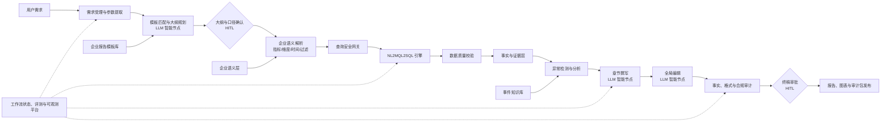

# 基于 NL2MQL2SQL、企业语义层与可信 AI 工作流的智能报告生成系统可行性分析报告（V2.0）

## 一、执行摘要

随着企业数字化转型不断深入，管理人员需要将分散在业务数据库、指标平台和知识库中的信息，快速转化为结构严谨、口径统一、证据可追溯的正式报告。传统报告生产依赖人工取数、核对、分析、撰写和排版，不仅周期长，而且容易产生指标口径不一致、数字引用错误、归因依据不足和审计链路缺失等问题。

本项目拟依托已经过业务验证的 NL2MQL2SQL 引擎，建设一套面向企业严肃报告场景的智能报告生产平台。系统不以“增加 Agent 数量”为目标，而采用**确定性工作流为主、LLM 智能节点为辅**的架构，将报告生产拆分为需求理解、模板规划、语义解析、受控取数、数据质量校验、事实构建、异常分析、文本生成、事实审计和人工审批等环节。

V2.0 方案将系统核心从“多 Agent 自动写报告”调整为：

> 以企业语义层统一指标口径，以事实与证据层约束内容生成，以可恢复工作流承载全流程，以自动审计和人工审批共同保障交付质量。

综合评估认为，本项目具有较高的业务价值和技术可行性，但其成功前提不是单纯提升模型能力，而是优先完成指标治理、数据契约、证据模型、评测体系、安全权限和运行状态管理。建议从单一内部周报场景切入，先证明系统能够稳定生成**准确、可追溯、可复核**的报告，再逐步增加异常归因和外部客户交付能力。

## 二、项目背景与建设目标

### 1. 业务背景

企业定期报告通常包含以下工作：

- 理解报告主题、对象、时间范围和管理意图；
- 从多个数据源提取并核对指标；
- 执行同比、环比、趋势和结构分析；
- 识别异常并结合业务事件解释原因；
- 按照固定模板形成正式文字和图表；
- 完成数字校验、措辞审核、合规审批和归档。

上述过程跨越业务、数据、写作和合规多个角色，传统方式存在数据链路长、重复劳动多、知识复用弱、交付标准不一致等痛点。尤其在金融及大型企业场景中，报告不仅要“写得快”，还必须满足指标口径一致、权限边界清晰、关键结论有据可查和过程可审计等要求。

### 2. 建设目标

本项目的建设目标包括：

1. **提升生产效率：** 将重复性的取数、核对、基础分析、写作和图表配置自动化。
2. **统一业务口径：** 所有指标通过企业语义层集中定义、版本化管理和权限控制。
3. **约束内容生成：** 报告中的量化陈述必须引用经过质量校验的事实对象。
4. **增强分析深度：** 在基础统计和异常检测的基础上，提供分层、可解释的原因假设。
5. **保证过程可控：** 在高风险节点设置人工确认，并支持暂停、恢复、重试、回退和审批。
6. **形成审计闭环：** 从最终结论回溯至指标定义、SQL、数据集快照、模板和生成版本。

### 3. 非目标与边界

系统第一阶段不追求：

- 面向任意数据库和任意报告类型的完全通用生成；
- 无需人工干预的全自治决策；
- 仅通过模型置信度替代数据校验和业务审批；
- 在证据不足时自动给出确定性因果结论；
- 对“零幻觉”作无法验证的绝对承诺。

系统应以“有证据约束、可测量、可审计、失败时安全退出”为可信目标。

## 三、总体设计原则

### 1. 工作流优先，Agent 按需使用

报告生成具有较明确的输入、步骤、质量门禁和交付物，适合采用预定义工作流。LLM 只负责自然语言理解、规划、解释和写作等非确定性任务；数据查询、权限校验、质量断言、数值计算、Schema 校验和事实核对由程序执行。

这一原则与当前业界“从简单、可组合的工作流开始，仅在开放式任务中引入自治 Agent”的实践一致。[^1]

### 2. 语义先于 SQL

自然语言不应直接映射到数据库字段或自由 SQL，而应先映射到经过治理的指标、维度、时间口径和过滤条件，再由 NL2MQL2SQL 引擎完成查询规划。指标定义集中管理能够减少不同部门、不同报告之间的口径漂移。[^2]

### 3. 事实先于文本

LLM 不直接读取大体量原始数据后自由总结，而是消费经过校验的事实对象和分析对象。先生成可审计事实，再生成文字，可以显著缩小模型自由发挥的空间。

### 4. 质量校验前置

数据完整性、及时性、唯一性和范围校验必须早于异常分析和报告写作。数据质量不合格时，系统应阻断、降级或明确标注，不得将脏数据包装成业务洞察。可复用断言、验证结果持久化和自动触发后续动作是成熟数据质量体系的常见模式。[^3]

### 5. 失败关闭与主动拒答

当指标含义不明确、权限不足、查询成本超限、数据质量失败或证据不充分时，系统应停止并请求确认，而不是猜测补全。任何置信度分数都不能绕过硬性安全规则。

### 6. 全链路版本化与可观测

模板、语义定义、Prompt、模型、规则和报告均应版本化。每次运行都需要记录状态、输入输出、耗时、成本和错误，确保问题可以定位、结果可以复现、变更可以回归验证。

## 四、目标架构设计

### 1. 总体架构



整体架构由五类能力组成：

1. **治理资产层：** 报告模板库、企业语义层、术语库、规则库和事件知识库。
2. **确定性执行层：** 查询安全、NL2MQL2SQL、数据质量、统计计算、图表 Schema 校验和事实审计。
3. **LLM 智能层：** 大纲规划、歧义识别、章节撰写、候选原因解释和全局编辑。
4. **工作流控制层：** 状态持久化、任务队列、人工中断、重试、超时、回退和幂等控制。
5. **交付与治理层：** 报告预览、证据查看、人工审批、版本归档、权限和审计日志。

### 2. 企业报告模板库

模板库定义报告“应该如何组织”，不保存具体业务数据。每个模板建议包含：

- `template_id` 与 `template_version`；
- 适用报告类型、业务域和目标读者；
- 章节树、必选章节和可选章节；
- 每章的写作目标、篇幅和语气要求；
- 推荐指标、维度、图表类型和质量规则；
- 参数槽位及其类型、必填性和默认策略；
- Few-Shot 样例及适用边界；
- 审批人、启停状态和变更记录。

模板变更应经过评审并保留历史版本，运行中的报告绑定具体模板版本，避免模板更新导致历史报告无法复现。

### 3. 企业语义层

企业语义层是 V2.0 架构的核心资产，负责将业务语言转换为可执行、可治理的数据语义。它不是简单术语字典，而是一套指标和数据关系的机器可读定义。

每个指标建议至少包含：

| 类别 | 建议字段 |
| --- | --- |
| 身份 | `metric_id`、名称、别名、业务域、负责人 |
| 定义 | 业务含义、计算公式、聚合方式、单位 |
| 粒度 | 时间粒度、业务粒度、可用维度 |
| 关系 | 来源模型、关联键、允许的 Join 路径 |
| 约束 | 默认过滤条件、互斥条件、适用范围 |
| 治理 | 版本、状态、生效时间、审批记录 |
| 安全 | 数据等级、角色权限、行列级策略、脱敏规则 |
| 质量 | 完整性、及时性、唯一性、范围和波动规则 |

原 Gatekeeper 插件升级为**语义解析与政策执行服务**：将用户请求解析为受控的 `metric_id + dimensions + filters + period + comparison`，对歧义、越权和无效组合进行拦截，再将结构化语义提交给 NL2MQL2SQL。

### 4. 事实与证据层

事实与证据层位于数据查询和文本生成之间，负责把查询结果转换成可引用的最小事实单元。建议采用三类核心对象：

```yaml
MetricQuerySpec:
  spec_id: qs_001
  metric_id: deployment_success_rate
  dimensions: [team]
  period: 2026-W26
  comparison: week_over_week
  filters: []
  semantic_version: 3.2.0

FactRecord:
  fact_id: fact_001
  metric_id: deployment_success_rate
  value: 97.2
  unit: percent
  period: 2026-W26
  dimensions: {team: platform}
  query_run_id: run_query_001
  dataset_snapshot: snapshot_20260705_001
  sql_hash: sha256:...
  quality_status: passed

ClaimRecord:
  claim_id: claim_001
  text: 平台团队本周部署成功率为 97.2%。
  claim_type: quantitative_fact
  evidence_refs: [fact_001]
  attribution_level: observed
  audit_status: passed
```

其中，`FactRecord` 由确定性程序生成，`ClaimRecord` 可以由 LLM 提议，但必须经过程序审计。报告中的数字、比例、排名、趋势和关键判断均应绑定一个或多个证据引用。

### 5. 分层归因模型

异常分析应区分“发现异常”和“解释异常”，并对结论强度进行分级：

| 级别 | 含义 | 输出要求 |
| --- | --- | --- |
| `observed` | 数据直接观察到的事实 | 必须引用结构化事实 |
| `associated` | 与其他变量或事件存在关联 | 标明关联，不表述为因果 |
| `hypothesis` | 基于现有证据提出的候选原因 | 使用“可能”“需进一步验证”等措辞 |
| `confirmed` | 已由业务规则、实验或人工确认的原因 | 必须引用确认记录或权威材料 |

Analyst 不应把相关性自动升级为因果关系。当外部事件通知、维护日志或政策文件参与解释时，应将其视为不可信输入，保留来源、时间和权限信息，并防范间接 Prompt Injection。

### 6. 工作流状态与运行控制

“避免复杂状态机”不等于“不要状态”。人工审批、长时间查询、失败重试和断点恢复都要求显式、持久的运行状态。生产实践通常通过检查点和持久化实现 HITL、容错和恢复。[^4]

每次报告运行建议维护：

- `report_run_id`、当前阶段和运行状态；
- 用户、租户、权限上下文和审批人；
- 模板、语义、Prompt、模型和规则版本；
- 各阶段输入输出的引用及内容哈希；
- 重试次数、超时、取消和降级记录；
- 人工修改内容、修改原因和审批意见；
- Token、模型调用、数据库扫描量、耗时和成本。

所有有副作用的节点应支持幂等执行。系统恢复或重试时，不得重复创建报告、重复发起高成本查询或覆盖已审批产物。

## 五、端到端业务流程

### 步骤 1：需求受理与实体提取

系统接收用户自然语言需求，提取报告类型、目标读者、业务范围、组织范围、时间范围、输出格式和截止时间。缺失必填信息时主动澄清，不自动猜测。

### 步骤 2：模板匹配与大纲规划

Planner 根据结构化需求选择模板版本，填充参数槽位，并在模板允许的范围内生成章节大纲。输出必须符合预定义 Schema。

### 步骤 3：大纲与口径人工确认

业务人员确认章节、指标、时间范围、组织范围、敏感项和预计查询成本。确认结果形成可追溯的审批记录。

### 步骤 4：语义解析与查询规划

系统逐章生成 `MetricQuerySpec`，通过企业语义层解析指标和维度。无法唯一映射的请求进入人工确认，不直接传递给数据库。

### 步骤 5：安全取数

查询安全网关校验权限、SQL 类型、访问对象、预计扫描量和超时限制。NL2MQL2SQL 仅使用只读凭证执行查询，并保存 SQL、参数、结果哈希和运行状态。

### 步骤 6：数据质量与统计计算

先执行完整性、及时性、唯一性、范围和业务断言，再进行同比、环比、趋势、结构和异常检测。质量失败时按规则阻断、降级或标注。

### 步骤 7：事实与分析对象构建

将通过校验的数据转换为 `FactRecord`，将异常、比较结果和候选解释转换为结构化分析对象。所有对象均携带来源和版本。

### 步骤 8：章节并行撰写与全局编辑

Writer 按章节读取有限的事实和写作规范，生成正文及 ECharts 配置。独立章节可以并行处理。Editor 负责全文结构、语气和引用一致性，但不得修改事实值或创造新结论。

### 步骤 9：自动审计

Auditor 对最终产物执行：

- 数字、单位、时间和维度一致性检查；
- 量化陈述与 `evidence_refs` 覆盖检查；
- 合计、比例、排序和同比/环比重新计算；
- 未经支持的因果措辞和确定性结论检查；
- Markdown、HTML 和 ECharts JSON Schema 校验；
- 敏感信息、禁用词和合规规则检查。

审计失败时，系统只将明确的冲突项退回对应节点，限制重试次数；多次失败后转人工处理，避免无休止的模型循环。

### 步骤 10：人工审批与发布

业务人员在证据可视化界面中查看“结论 - 指标 - SQL - 数据源”的关联，完成政策性定调和最终审批。系统发布报告、图表配置和审计包，并对版本进行归档。

## 六、人机协同边界

### 1. 人在回路（HITL）

人类负责方向、权限、风险和价值判断：

- 确认报告目的、大纲、统计范围和指标口径；
- 处理无法唯一解析的业务歧义；
- 审批敏感数据访问和高成本查询；
- 判断原因假设是否符合业务事实；
- 对负面、敏感或政策性内容进行最终定调；
- 审批模板、指标、规则和知识库变更。

### 2. 机器在回路（MITL）

机器负责可重复、可验证的任务：

- Schema 校验、权限判断和查询安全检查；
- 受限重试、错误分类和确定性修复；
- 数据质量断言和统计计算；
- 数值、单位、时间、维度和引用一致性审计；
- 状态保存、断点恢复、超时和成本控制；
- 回归评测、运行监控和异常告警。

### 3. 升级人工处理的条件

出现以下情况时必须停止自动流转：

- 一个业务术语匹配多个有效指标；
- 请求超出用户的数据权限或报告授权范围；
- 数据质量规则失败且无法通过既定降级策略处理；
- SQL 重试达到上限或查询成本超过预算；
- 关键结论缺少证据或多个数据源发生冲突；
- 自动审计多次失败；
- 系统试图输出 `confirmed` 级别但没有确认记录。

## 七、安全、合规与权限设计

LLM 应用面临提示注入、敏感信息泄露、不安全输出处理和过度授权等风险。[^5] 本系统直接连接企业数据源，必须将安全控制放在模型之外，并遵循最小权限原则。

### 1. 数据访问安全

- 数据库账号默认只读，禁止 DDL、DML、存储过程和外部网络调用；
- 采用租户隔离、角色权限、行级和列级访问控制；
- 敏感字段在进入模型前完成脱敏或聚合；
- 原始数据、Prompt、日志和报告分别设置保留周期；
- 禁止将密钥、连接串和完整敏感数据写入模型上下文或普通日志。

### 2. 查询安全

- 使用 SQL AST 解析器执行白名单校验，不依赖字符串匹配；
- 限制可访问库表、返回行数、执行时间和扫描数据量；
- 执行前进行成本估计，超预算查询必须审批；
- 使用参数化查询，记录 SQL 哈希和参数，不拼接不可信输入；
- 对重复请求使用受控缓存，并校验租户、权限、语义版本和数据时效。

### 3. LLM 与知识库安全

- 将用户文本、RAG 文档和数据库内容视为数据，不赋予其系统指令权限；
- 对工具参数使用严格 Schema，并在工具执行前进行独立鉴权；
- 限制每个智能节点可使用的工具、数据范围和最大调用次数；
- 对模型输出进行转义和格式校验，禁止直接执行模型生成的代码；
- 开展 Prompt Injection、越权访问、数据泄露和资源耗尽专项测试。

### 4. 合规治理

建议参考 NIST AI RMF 的治理、识别、测量和管理思路，将模型风险纳入项目全生命周期，而不是仅在发布前做一次性检查。[^6]

## 八、评测体系与验收标准

企业级 Text-to-SQL 在真实复杂数据库上仍具有明显挑战，不能仅以“SQL 可执行”代表结果正确。[^7] 项目应在 MVP 开发前建立覆盖真实业务表达、歧义和边界情况的黄金数据集。

### 1. 分层离线评测

| 环节 | 核心指标 | MVP 建议目标 |
| --- | --- | --- |
| 需求与模板 | 必填实体提取准确率、模板匹配率、大纲覆盖率 | 核心场景不低于 95% |
| 语义解析 | 指标映射准确率、维度/时间/过滤正确率、歧义拒答率 | 治理指标集不低于 95% |
| NL2MQL2SQL | 执行成功率、结果等价率、安全规则通过率 | 执行成功率不低于 98%，结果等价率不低于 95% |
| 数据质量 | 已知异常检出率、误报率、规则覆盖率 | 关键质量规则 100% 覆盖 |
| 文本生成 | 事实一致率、证据覆盖率、无依据结论率 | 关键数字一致率与证据覆盖率 100% |
| 图表生成 | Schema 通过率、数据绑定正确率 | 100% 通过自动校验 |
| 端到端 | 人工一次通过率、人工修改率、生产时长、单份成本 | 一次通过率不低于 80%，人工耗时降低 50% 以上 |

以上目标为 MVP 建议门槛，应根据现有引擎基线和业务风险等级校准。关键数字一致率属于发布硬门禁，不应以平均分掩盖单份报告错误。

### 2. 黄金数据集构成

黄金数据集至少应覆盖：

- 常规问题、口语表达、同义词和缩写；
- 时间边界、跨期、同比和环比；
- 多指标、多维度和复杂过滤；
- 指标歧义、缺失参数和不允许组合；
- 无权限请求、敏感字段和恶意输入；
- 空数据、迟到数据、异常值和冲突数据；
- SQL 可执行但业务结果错误的反例；
- 数字正确但单位、时间或维度错误的报告反例。

### 3. 回归与线上评测

- 模型、Prompt、模板、语义定义和规则的每次变更必须触发回归评测；
- 新版本先影子运行或小流量灰度，不直接覆盖稳定版本；
- 线上记录人工修改、驳回原因和缺失指标，定期回流黄金数据集；
- 人工反馈不得未经审核直接修改 Prompt、模板或语义定义；
- 按报告类型分别统计质量、成本和效率，避免平均指标掩盖高风险场景。

## 九、数据血缘与可观测性

数据血缘不应只记录 UUID 和 SQL，而应覆盖整个报告生产链：

```text
用户需求
  -> 模板与语义版本
  -> 查询规约
  -> SQL 与查询运行
  -> 数据集快照与质量结果
  -> FactRecord
  -> ClaimRecord
  -> 章节与图表
  -> 审计结果
  -> 审批记录
  -> 发布版本
```

OpenLineage 的 `Job、Run、Dataset、Facet` 事件模型可作为数据运行和质量血缘的协议参考。[^8] OpenTelemetry 的统一语义约定可用于关联服务调用、模型调用、工具执行、指标和日志。[^9]

### 1. 建议监控指标

- 各阶段成功率、重试率、阻断率和人工升级率；
- P50/P95 运行时长和各节点耗时；
- 模型调用次数、Token、缓存命中率和费用；
- SQL 执行时长、扫描量、超时率和结果行数；
- 数据质量失败率和异常检测命中率；
- 审计失败类型、人工修改率和发布驳回率；
- 模板、指标和业务域维度下的质量趋势。

### 2. 日志与隐私

可观测性系统本身也必须执行权限和脱敏策略。Prompt、模型输出、SQL 参数及数据样本可能包含敏感信息，应支持字段级脱敏、分级访问和审计留痕。

## 十、项目可行性评估

### 1. 技术可行性：较高，但有明确前提

有利条件：

- NL2MQL2SQL 已通过真实业务验证，降低了最关键取数链路的不确定性；
- 报告场景结构相对固定，适合模板化和工作流化；
- 数据质量、统计计算、Schema 校验和血缘管理均可由成熟工程技术实现；
- LLM 在需求理解、文本生成和风格统一方面具有明确价值。

前提条件：

- 建立可运行的企业语义层，而非依赖 Prompt 临时解释指标；
- 为现有 NL2MQL2SQL 建立业务结果等价评测，而不仅是语法成功率；
- 建立事实对象和证据引用协议；
- 对工作流状态、权限和审计进行工程化建设。

### 2. 业务可行性：高

内部周报、月报、运维报告和管理复盘具有频率高、格式相对固定、人工成本可度量等特点，适合作为首批场景。系统价值可以通过报告生产耗时、人工修改率、数字错误率和交付及时率直接衡量。

外部客户报告价值更高，但同时涉及品牌、合同、监管和数据合规风险，应在内部场景达到稳定质量门槛后再开放。

### 3. 工程复杂度：中等，不宜低估

LLM 调用本身不是主要复杂度，真正工作量集中在：

- 指标和维度治理；
- 跨步骤数据契约；
- 查询安全与数据权限；
- 长流程状态持久化和恢复；
- 事实、引用、审计与可视化；
- 黄金数据集和持续回归评测。

因此，项目可以渐进落地，但不应将其估计为简单的 Prompt 串联项目。

### 4. 成本可行性：可控

通过以下措施可以控制成本：

- 在高成本查询前进行口径确认和查询预算审批；
- 独立章节并行处理，简单任务路由到较小模型；
- 缓存稳定的模板、语义上下文和重复查询结果；
- 向 Writer 提供精简事实对象，而不是完整数据集；
- 限制重试轮数、下钻深度和最大 Token；
- 持续监控单份报告的模型费用与数据库计算费用。

## 十一、主要风险与应对措施

| 风险 | 可能影响 | 应对措施 |
| --- | --- | --- |
| 指标口径不完整或冲突 | 生成结果业务上错误 | 语义层集中治理、版本审批、歧义阻断 |
| SQL 可执行但结果不正确 | 报告引用错误数据 | 结果等价测试、黄金查询、抽样复核 |
| 数据质量异常 | 将脏数据解释为业务异常 | 质量门禁前置、失败关闭、数据责任人告警 |
| LLM 创造无依据结论 | 误导管理决策 | 事实对象约束、证据覆盖审计、措辞分级 |
| 将相关性表述为因果 | 产生错误归因 | 分层归因模型、证据等级、人工确认 |
| Prompt Injection 或越权 | 数据泄露、工具滥用 | 最小权限、外部政策层、工具独立鉴权、红队测试 |
| 无限重试或下钻 | 成本和时延失控 | 次数、深度、Token、时间和扫描量预算 |
| 模型或 Prompt 更新回归 | 稳定场景质量下降 | 版本固定、自动回归、影子运行和灰度发布 |
| 人工审批流于形式 | 风险未被真正识别 | 展示差异与证据、风险分级、记录审批责任 |
| 日志包含敏感信息 | 形成新的数据泄露面 | 日志脱敏、分级权限、保留周期和访问审计 |

## 十二、MVP 范围与实施路线

### 阶段 0：基础准备与基线评测（建议 2～3 周）

目标是确认“可以做什么、如何证明做对了”。

- 选定一个内部研发效能周报场景；
- 固化 1 个报告模板和 10～20 个核心指标；
- 定义 `MetricQuerySpec`、`FactRecord`、`ClaimRecord` 和报告产物契约；
- 建立不少于 100 条代表性需求的黄金数据集；
- 测量现有 NL2MQL2SQL 的执行成功率、结果等价率、时延和成本；
- 明确数据权限、脱敏规则和发布审批责任人。

### 阶段 1：可信报告 MVP（建议 4～6 周）

目标是稳定生成“数据准确、证据可追溯”的内部报告。

- 实现需求受理、模板规划、人工确认和语义解析；
- 接入只读 NL2MQL2SQL 和查询安全网关；
- 实现基础数据质量规则和事实对象构建；
- 实现章节撰写、基础图表和数字证据审计；
- 支持状态持久化、失败重试、断点恢复和人工审批；
- 输出 Markdown/HTML 报告及审计包。

阶段 1 暂不包含开放式自动归因和无限多轮下钻。

### 阶段 2：分析增强与生产治理（建议 4～6 周）

- 增加同比、环比、趋势、结构和异常检测；
- 接入维护日志、变更记录和政策事件知识库；
- 实现分层归因与原因假设人工确认；
- 完善 OpenLineage/OpenTelemetry 兼容的血缘和可观测能力；
- 建立模型、Prompt、模板和语义定义的发布流水线；
- 引入影子运行、灰度发布和持续评测。

### 阶段 3：业务扩展与外部交付

- 扩展至管理复盘、业务诊断和风险月报；
- 支持多模板、多业务域和多级权限；
- 建立面向外部客户的合规检查、品牌规范和正式签发流程；
- 根据真实运营数据优化模型路由、缓存和成本预算；
- 在达到更高验收门槛后，逐步开放外部报告交付。

以上周期为参考估算，前提是核心数据源可访问、指标负责人能够持续参与，且现有 NL2MQL2SQL 接口稳定。语义治理或数据权限准备不足会直接影响进度。

## 十三、建议团队与职责

MVP 建议由以下角色共同承担：

- **业务产品/报告专家：** 定义场景、模板、指标口径和验收标准；
- **数据工程师：** 建设语义层、数据质量、血缘和查询评测；
- **后端/工作流工程师：** 实现状态管理、安全网关、任务执行和审计服务；
- **AI 应用工程师：** 负责智能节点、结构化输出、Prompt 和模型评测；
- **前端工程师：** 实现大纲确认、证据查看、报告编辑和审批体验；
- **测试与安全人员：** 建设回归、权限、注入、越权和数据泄露测试。

其中，业务专家和指标负责人不是项目外围支持角色，而是语义资产和验收标准的共同所有者。

## 十四、结论与近期行动建议

基于现有 NL2MQL2SQL 引擎已经跑通的事实，本项目具备良好的技术起点和明确的业务价值。原方案中的线性主流程、插件化控制和 HITL 思路是合理的，但要达到企业级交付标准，需要将系统中心从“Agent 协同”进一步转向“语义治理、事实证据、工作流可靠性和持续评测”。

建议立即启动以下工作：

1. **选定单一 MVP 场景：** 以内部研发效能周报为首个落地对象，冻结首版业务范围。
2. **建设最小语义层：** 完成 10～20 个核心指标的定义、权限、质量规则和版本审批。
3. **制定核心数据契约：** 优先确定查询规约、事实、结论、审计和报告产物的 Schema。
4. **建立黄金数据集：** 在开发智能节点前测出现有 NL2MQL2SQL 和人工流程基线。
5. **实现最小可信闭环：** 先完成“确认口径 -> 安全取数 -> 事实构建 -> 报告生成 -> 证据审计 -> 人工发布”。
6. **推迟复杂归因：** 待基础闭环稳定后，再加入自动异常下钻和外部事件归因。

最终应将本项目定位为：

> 一套基于 NL2MQL2SQL、企业语义层和证据链的可信报告生产平台，而不仅是一套自动写作工具。

## 参考资料

[^1]: Anthropic, [Building Effective AI Agents](https://www.anthropic.com/engineering/building-effective-agents).
[^2]: dbt Labs, [dbt Semantic Layer](https://docs.getdbt.com/docs/use-dbt-semantic-layer/dbt-sl)；[About MetricFlow](https://docs.getdbt.com/docs/build/about-metricflow).
[^3]: Great Expectations, [Run a Checkpoint](https://docs.greatexpectations.io/docs/core/trigger_actions_based_on_results/run_a_checkpoint/).
[^4]: LangGraph, [Interrupts and Human-in-the-Loop](https://langchain-ai.github.io/langgraph/how-tos/human_in_the_loop/breakpoints/)；[Persistence](https://langchain-ai.github.io/langgraph/cloud/concepts/threads/).
[^5]: OWASP, [Top 10 for Large Language Model Applications](https://owasp.org/www-project-top-10-for-large-language-model-applications/).
[^6]: NIST, [Artificial Intelligence Risk Management Framework: Generative Artificial Intelligence Profile](https://nvlpubs.nist.gov/nistpubs/ai/NIST.AI.600-1.pdf).
[^7]: Cao et al., [Spider 2.0: Evaluating Language Models on Real-World Enterprise Text-to-SQL Workflows](https://arxiv.org/abs/2411.07763).
[^8]: OpenLineage, [Object Model](https://openlineage.io/docs/next/spec/object-model/).
[^9]: OpenTelemetry, [Semantic Conventions](https://opentelemetry.io/docs/concepts/semantic-conventions/).
