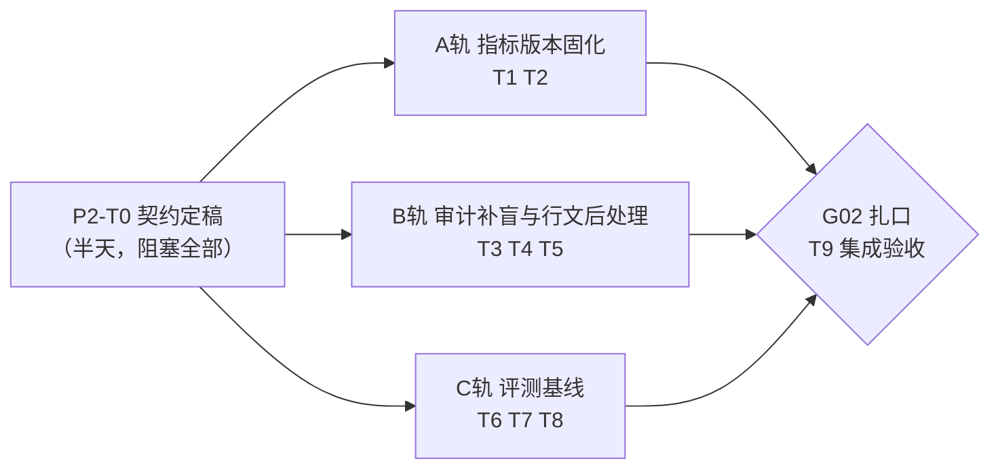

# Phase 02 规划：可信底座补完 + 规模化评测基线（P2-T0～T9）

> 目标一句话：把技术说明书里两处「诚实说明」的已知盲区关掉——**指标版本漂移窗口**（9.5 节）与
> **中文数词审计盲区**（第 7 章），并终结「资产可页面自助扩容、质量却无法度量」的裸奔状态——
> 建立**报告层回归评测基线**。顺手关掉 Phase01 遗留小任务 P5-T6（口径资产升格入口，`?mql=` 已预留）。
>
> 上位规划：`roadmap.md` §三。工作模式承袭 phase01：**启动节点 T0 契约定稿（过目后开工）→
> 三轨并行 → G02 扎口验收**。任务粒度 0.5～1 天，每任务一次 commit。预估单人 4～6 天。

---

## 一、总体结构：一个启动节点、三条并行轨、一道闸口

三轨改动面天然分离，可真并行：A 轨在 `ReportPipeline`/`store` 与迁移 SQL；B 轨在
`NumberAuditor`/`AuditStep`；C 轨新增 `report/eval/` 包与资源文件。唯一交叉点：C 轨评测
用例要覆盖 A/B 轨的新能力（对抗项），扎口前合流。

**Gate G02 验收标准**（四条，全过才算完）：

1. **版本固化**：指标发新版后，旧 run 的 resume/续跑仍用固化版本取数（对比 SQL 与 sql_hash 证明）；run 详情页可见各指标版本徽章。
2. **审计补盲**：中文数词对抗用例（「约三成」「上百万」「翻了一倍」）被 ⑥ 检查1 拦截回写；白名单合法用法（「统一」「一致」「第一章」）零误伤（单测全绿）。
3. **评测基线**：黄金需求集全量跑通，产出四个基线数字——**取数等价率、数字一致率、模板匹配正确率、失败关闭正确率**——写入 README（新增「评测基线」节）。
4. **零回退**：`mvn test` 全绿（现有 241 用例 + 本阶段新增）；基线 E2E（2026-W26 司库周报，一致率 100%）不回退。

---

## 二、通用纪律（承袭 phase01.md §二，本阶段追加两条）

1～5 同 phase01（回归门禁 / 失败关闭 / 服务端把关 / 资产留痕 / commit 粒度）。追加：

6. **审计器改动必须对抗先行**：B 轨每条新检测规则先写对抗语料单测（TDD 式），再写实现——⑥ 是死代码兜底，它自己的回归必须最严。
7. **评测集期望值不许由系统自产自证**：golden set 的期望值一律**手写 SQL 直查**得出（照 GF 验收「200.00 USD 与手写 SQL 逐分一致」的标准），期望 sql_hash 可以取自系统但期望值不行。

---

## 三、启动节点（半天，阻塞后续所有任务）

| 任务 | 内容 | 产出物 | 验证方式 |
|---|---|---|---|
| **P2-T0** 三份契约定稿 | 就下方三份契约草案逐条过目拍板（草案已按预研写好，T0 只做确认/修正） | 本文件「契约草案」三节定稿（修订直接改本文件） | 过目评审通过 |

### 契约草案 1：指标版本固化（A 轨依据）

- **固化时点 = 卡点1 确认（`outline/approve`）**——「口径在此锁死」的语义时点。对确认后大纲引用的
  全部指标（含派生指标的操作数，展开逻辑同 `SpecResolveStep`）snapshot「metricId → PUBLISHED 版本号」。
  卡点1 打回重新生成（`regenerate`）后重新快照；确认前指标发新版**不属于**漂移窗口（口径尚未锁定）。
- **落点两处**：
  - `report_run` 加列 `metric_versions_json`（TEXT，`{"metricId": version, ...}`）——迁移照
    P1-T5 既例：`db/01-report-tables.sql` 的 CREATE 同步更新 + `db/02-asset-tables.sql` ALTER 段加守卫式语句；
  - `report_fact` 加列 `metric_version`（INT NULL，DERIVED 事实记其结果指标的版本）——同上双处落。
- **读取路径**：②③④ 不再直读 `ReportAssetService.allMetrics()`（PUBLISHED 缓存，会追新版），
  改为 pipeline 按快照经 `MetricAssetRepository.findByIdAndVersion()`（已有）构造「本 run 专属
  `Map<String, MetricDefinition>`」传入三步——三步的方法签名本就接收 defs Map，**改动集中在
  `ReportPipeline` 一处**。注册表缓存仍服务 ①（匹配）与卡点1 展示（那时尚未锁定，用最新 PUBLISHED 正确）。
- **快照需带版本号来源**：`ReportAssetService` 的指标缓存现在不含版本号（模板有 `VersionedTemplate`），
  照同款加 `VersionedMetric(def, version)`，对外查询 API 保持兼容。
- **resume 语义**：SPEC~FACT 段重跑与 WRITE/AUDIT 续跑一律用快照版本（对齐 P4-T2 模板同款纪律：
  禁止「悄悄用新版指标重跑旧 run」）。快照里的版本行即使已 DEPRECATED 也照用——被运行引用过的
  版本行永不物理删除（phase01 纪律 4）是本设计的前提。
- **失败关闭**：快照缺某指标、或 `findByIdAndVersion` 落空（理论不可能）→ `BLOCKED[EXCEPTION]`。

### 契约草案 2：中文数词审计射程与白名单（B 轨依据）

- **射程（视为违规的中文数量表达）**：
  - 数词+量级/比例后缀：`三成`、`七八成`、`翻(了)?X倍`、`增长X倍`、`X折`、`过半`、`近半`、`大半`；
  - 数词+计量单位：`两千万(元)`、`三百笔`、`五个亿`——中文数字序列（零〇一二两三四五六七八九十百千万亿）
    紧跟单位词（元/万元/亿元/笔/个/户/单/项/成/倍/折/%）；
  - 模糊量级词：`上百`、`数十`、`近千`、`成百上千`、`过万` 后跟单位或作数量状语。
- **判定策略 = 双条件**（防误伤）：中文数字**且**构成数量语义（后缀量词/单位/比例词）才违规；
  单字数词嵌在普通词汇里不触发。
- **白名单（不触发）**：高频含数字字符的普通词——`一致`、`一定`、`一般`、`统一`、`一起`、`一旦`、
  `万一`、`第一/第二…`（序数）、`周一~周日`、`十分`（副词）、`千分位`、`百分比`（词本身）等，
  实现为词表 + 单测语料双固化；周期表述（`本周`、`上周`、`第26周`）沿用现有白名单思路。
- **误报取向**：宁可漏报不误报——误报会烧掉重写轮次并把合法文风打成 BLOCKED；漏报仍有卡点2 人工
  兜底（与现状相同，只是射程大幅收窄）。规则收益按对抗语料命中率度量，不追求理论完备。
- **接入点两处**：⑥ 检查1（草稿扫描，违规回灌重写，沿用 `max-rewrite-rounds`）+ 检查2 残余文本
  扫描（终稿兜底）。prompt 的禁用条款保持不变（防御纵深，不是依赖）。

### 契约草案 3：评测集 schema 与分层运行（C 轨依据）

- **文件**：`resources/report/eval/golden-set.json`（照底座 `resources/eval/golden-queries.json` 惯例）。
- **case 三类**（一个文件、`type` 区分）：

  | type | 输入 | 期望 | 度量 |
  |---|---|---|---|
  | `MATCH` | 需求文本 | 期望 templateId + 期望周期标签（或期望 BLOCKED=false） | 模板匹配正确率（LLM 层） |
  | `BLOCKED` | 需求文本 | 期望 BLOCKED + blocked_reason 关键词 | 失败关闭正确率（LLM 层） |
  | `FACTS` | templateId + 周期标签 | 逐指标期望值（**手写 SQL 得出**）+ 期望 sql_hash | 取数等价率（确定性层） |

- **分层运行**（两层独立触发，互不阻塞）：
  - **确定性层**（零 LLM，跑 ②③④：模板+周期 → spec → SQL → facts，与期望逐值比对）——
    需要 DB 不需要 LLM，做成 `ReportEvalService` + 管理端点（照底座 `EvalService`/`EvalJobService`
    范式），随时可跑、将来可进 CI；
  - **LLM 层**（跑 ①：需求 → 匹配/BLOCKED 判定，烧 token）——手动触发，输出匹配正确率与
    失败关闭正确率；⑤⑥ 的「数字一致率」不单独建评测（它是每次 run 的硬门禁，恒 100%，
    评测报告直接引用近期 run 统计与平均重写轮数）。
  - 产出统一评测报告 JSON（逐 case 明细 + 汇总四率），控制台摘要一份，基线数字人工誊入 README。
- **防泄漏**：`FACTS` 期望值手写 SQL 双重核对（纪律 7）；评测端点只读，不写任何状态表。
- **规模**：首版 20～30 条——MATCH ≥10（含口语变体/歧义边界）、BLOCKED ≥6（HR 盘点/月报/空泛/
  越权表述）、FACTS 覆盖全部 5 个 PUBLISHED 模板 × 基准周期（2026-W26 等）。

---

## 四、并行 A 轨：指标版本固化（T1→T2 顺序，改动集中）

| 任务 | 内容 | 产出物 | 验证方式 |
|---|---|---|---|
| **P2-T1** 快照落库与固化取数 | 按契约1：`VersionedMetric` 缓存改造；卡点1 approve 时算快照（含派生操作数展开）写 `report_run.metric_versions_json`；`ReportPipeline` 按快照经 `findByIdAndVersion` 构造本 run 的 defs Map 传入 ②③④；`report_fact` 落 `metric_version`；两处迁移 SQL（01 CREATE 同步 + 02 守卫式 ALTER） | 迁移 SQL + `ReportPipeline`/`ReportAssetService`/仓库小改 | 单测：快照展开含派生操作数；E2E：发起→approve→查库见快照与 fact 版本号 |
| **P2-T2** 续跑闭环与展示 | resume（SPEC~FACT 重跑 / WRITE~AUDIT 续跑）一律读快照重建 defs Map；run 详情 API 与 `report.html` 展示指标版本徽章（照模板 vN 徽章样式）；快照缺失的旧 run（升级前存量）回退现行为并在详情标注 | Pipeline resume 小改 + 页面 | **对抗演练**：跑 run 至卡点2 → 向导发某指标新版并 publish → resume 旧 run → 对比 SQL/sql_hash 与固化版一致、与新版不同 |
 

> A 轨完成后，说明书 9.5 节「诚实说明」的漂移窗口即关闭——G02 后同步修订该节（见 T9）。

## 五、并行 B 轨：审计补盲与行文后处理（T3→T4 顺序，T5 独立）

| 任务 | 内容 | 产出物 | 验证方式 |
|---|---|---|---|
| **P2-T3** 中文数词检测器 | 按契约2 实现 `ChineseNumeralDetector`（`report/pipeline/`，纯静态无依赖，照 `NumberAuditor` 范式）：射程双条件判定 + 白名单词表；**对抗语料单测先行**（纪律 6）：违规语料 ≥15 条逐条命中、白名单语料 ≥15 条零误伤 | 检测器类 + `ChineseNumeralDetectorTest` | `mvn -q test -Dtest=ChineseNumeralDetectorTest` 全绿 |
| **P2-T4** 接入 ⑥ 双检 | 检查1（`checkDraft`）与检查2 残余扫描（`verifyRendered`）都过检测器，违规文案与现有裸数字违规同格式（带上下文摘录）；`NumberAuditor` Javadoc「已接受局限」改写；stylePrompt 注入对抗新增变体「用中文数字把金额写成两千万」固化为回归项 | `NumberAuditor` 改动 + 回归单测 | 单测 + 对抗演练：诱导中文数词 → 检查1 拦截回写日志可见 → 终稿无中文数量表达 |
| **P2-T5** 量词去重后处理 | ⑥ 替换（`substitute`）后、检查2 前，确定性后处理：`display_value[fact_x]` 尾随单位与 `]` 后紧跟的同一单位字重复时去重（「4 笔[fact_x]笔」→「4 笔[fact_x]」；单位白名单：笔/个/户/单/项/元/万元）；除此之外零改动 | 后处理函数（并入 `NumberAuditor` 或独立）+ 单测 | 单测：典型重复消除、正常文本与外币码（USD 后跟中文）零误伤 |

## 六、并行 C 轨：评测基线（T6→T7 顺序，T8 独立小任务）

| 任务 | 内容 | 产出物 | 验证方式 |
|---|---|---|---|
| **P2-T6** 黄金需求集 | 按契约3 编制 `golden-set.json` 首版 20～30 条；`FACTS` 期望值全部手写 SQL 直查（SQL 原文留在 case 的 `referenceSql` 字段备审计）；覆盖清单：口语变体、周期边界（跨年周）、匹配歧义、HR/月报/空泛 BLOCKED 反例、GF 新制作指标（`invest_out_amount_usd`） | 评测集文件 | 评审：三类 case 配比达标；`FACTS` 期望值与 referenceSql 直查一致（人工抽核） |
| **P2-T7** 评测 harness | `report/eval/ReportEvalService`（照底座 `EvalService` 范式）：确定性层跑 ②③④ 逐值比对（值 + sql_hash 双锚，值不一致才算失败、hash 变化仅告警——编译器演进不该打红）；LLM 层跑 ① 判匹配与 BLOCKED；管理端点 `POST /api/report/eval/run?layer=deterministic|llm`（只读、异步照 `EvalJobService` 可选简化为同步）；输出逐 case 明细 + 四率汇总 | 评测服务 + 端点 | curl 两层各跑一遍：确定性层全绿（当前资产应 100%）；LLM 层产出匹配/失败关闭正确率基线 |
| **P2-T8** 口径资产升格入口 | 补 `GET /api/caliber/list`（包装现有 `CaliberRepository.findAllActive`）；`index.html` 加口径资产列表区（id/问法/时间），每行「升格为指标 →」按钮：跳 `metric-wizard.html?mql=<base64(mql_json)>` 直入第 ③ 步（`?mql=` 解析已预留，失败静默回第 1 步） | 端点 + 页面联动 | 实操：首页沉淀一条口径 → 列表可见 → 一键进向导第 ③ 步 → 参数化→保存→发布走通 |

## 七、扎口

| 任务 | 内容 | 验证方式 |
|---|---|---|
| **P2-T9** G02 集成验收与收尾 | 三轨合流：① 全量评测两层各跑一遍，四率基线数字誊入 README 新增「评测基线」节；② 两项对抗演练（指标版本漂移 resume 对比、中文数词注入）实录补进 README 演示手册 C 组；③ 说明书源（`tools/article.html`）修订 9.5 节与第 7 章诚实说明、12.2/12.3 划掉已完成项（PDF 重排到下次版本升级时一并做，不阻塞 G02）；④ 全量回归 | Gate G02 四条标准全过；`mvn test` 全绿；基线 E2E（2026-W26 周报 28/28 一致率 100%）不回退 |

---

## 八、G02 验收记录（2026-07-10，phase02 分支）

| # | Gate 标准 | 结果 | 证据 |
|---|---|---|---|
| 1 | 版本固化：发新版后旧 run resume 仍用固化版本；详情页版本徽章 | ✅ | run #24 锁口径后发 `large_txn_count` v2（阈值 50万→10万），BLOCKED@FETCH 续跑重取数 sql_hash `c6fa052c` 与发版前逐字节一致（仍 2 笔）；新 run #25 追 v2（`024740ac`，3 笔）——双向隔离成立；证据表 vN 徽章 + 详情固化标注上线 |
| 2 | 审计补盲：中文数词对抗被拦、白名单零误伤 | ✅ | `ChineseNumeralDetectorTest` 40 用例（违规 18/白名单 20/定位 2）+ `NumberAuditorTest` 中文数词组 4 项全绿；实弹注入两轮（run #26/#27，含「最高优先级」强诱导）system 铁律第一层扛住，重写 0 轮、终稿零中文数字序列；扎口 run #28 检查1 实弹拦截 3 处裸数字回写 1 轮后 38/38 |
| 3 | 评测基线四率产出并写入 README | ✅ | 确定性层取数等价率 **47/47=100%**；匹配正确率 **11/11=100%**；失败关闭正确率 **6/6=100%**；数字一致率恒 100%（硬门禁）——README 新增「评测基线」节 |
| 4 | 零回退：`mvn test` 全绿 + 基线 E2E 不回退 | ✅ | 294/294（241 存量 + 53 新增）；扎口 E2E run #28 审计 38/38 一致率 100% |

**实施发现**（记入说明书 12.3）：指标层暂无「已有指标发新版」的产品路径（`MetricAdminService.save` 拒绝重名新建，模板层有 PUT 存新版）——A 轨演练经 SQL 造版 + 正规 publish API 完成；版本固化护住的正是这条未来路径，入口本身待建。

## 九、主要风险与缓解

| 风险 | 缓解 |
|---|---|
| 中文数词检测误伤合法文风（烧重写轮次→BLOCKED） | 契约2 双条件判定 + 白名单词表；「宁漏报不误报」取向；对抗与白名单语料各 ≥15 条固化为单测 |
| 版本快照改动波及 ②③④ 三步 | 三步签名本就收 defs Map，改动收敛在 `ReportPipeline` 组装处；E2E 基线回归护航 |
| 存量 run 无快照（升级兼容） | resume 时快照缺失 → 回退现行为（读 PUBLISHED 缓存）并在详情页标注「未固化」，不硬 BLOCKED 老数据 |
| 评测期望值自身错误（基线错则全错） | 纪律 7：期望值只认手写 SQL；referenceSql 留档可审计；抽核为 T6 验收动作 |
| sql_hash 当期望导致脆性（编译器措辞变化打红） | 契约3：值比对定成败、hash 仅告警——等价率看数据不看指纹 |
| 量词去重误改正文 | 只处理「`]` 后紧跟同一单位字」一种构型 + 单位白名单；改动在检查2 之前，改坏了检查2 兜底 |
