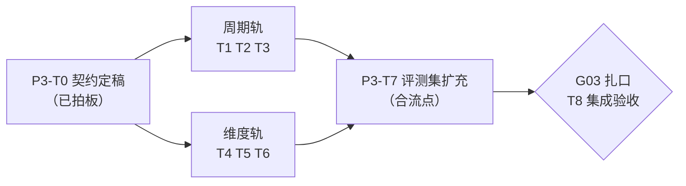

# Phase 03 规划：周期与维度扩展（P3-T0～T8）

> 目标一句话：报告从「仅 ISO 周」扩展到**月报与季报**（演示 11 的 BLOCKED 翻转为能力），比较从「仅环比」
> 扩展到**环比+同比**（month_over_month / quarter_over_quarter / year_over_year），事实从「单值」扩展到
> **按维度拆解的多行**（`FactRecord.dimensions` 契约与 `report_fact.dimensions_json` 列自 Phase01 起
> 预留、恒为空——本阶段是**填充不是改结构**）。周报新增「按币种拆解」章节，每行数字仍过 ⑥ 逐格核对。
>
> 上位规划：`roadmap.md` §四。工作模式承袭 phase01/02：**启动节点 T0 契约定稿（已过目拍板）→
> 两轨并行 → G03 扎口验收**。任务粒度 0.5～1 天，每任务一次 commit。预估单人 7～10 天
> （较 roadmap 原估 5～8 天上浮：T0 拍板将季报与同比纳入本阶段）。

---

## 一、总体结构：一个启动节点、两条并行轨、一道闸口

两轨改动面大体分离，可真并行：周期轨在 `PeriodResolver`/`OutlineStep`/`SpecResolveStep`/模板 schema 与种子；
维度轨在 `MetricDefinition`/`FetchStep`/`FactBuildStep`/`WriteStep`/`NumberAuditor`。
**交叉点两处**，契约已划清：① `FactBuildStep` 两轨都动（周期轨泛化比较循环、维度轨改多行造 fact），
按「T5 等 T3 合入后再动」串行避冲突；② 评测集扩充（T7）要同时覆盖两轨新能力，扎口前合流。

**T0 拍板记录（2026-07-11，过目评审通过）**：① **季报与同比本阶段都做**（roadmap「视种子数据覆盖决定」
在此拍板为做，种子范围相应扩大）；② **补增量种子数据**（2026-05 上旬 + 2026-04 + 2026-Q1 稀疏 +
2025-Q2 稀疏，只增不改）；③ **fact_key 维度后缀与双上限按草案**（`fact_007_usd`/`_share`；
单指标维度行 ≤12、单章 fact ≤20，触顶 BLOCKED 不静默截断）。

**Gate G03 验收标准**（五条，全过才算完；较 roadmap 原三条按拍板扩展）：

1. **月报能力**：「生成 2026 年 6 月资金月报」端到端签发（①匹配月报模板 → 卡点1 → ②③④⑤⑥ → 卡点2 →
   PUBLISHED），演示 11 由 BLOCKED 反例翻转为正向能力；月环比（M06 vs M05）与**月同比（M06 vs 2025-M06）**
   数字审计 100%。
2. **季报能力**：「生成 2026 年二季度资金季报」端到端签发；季环比（Q2 vs Q1）与季同比（Q2 vs 2025-Q2）
   数字审计 100%。
3. **维度能力**：周报含「按币种拆解」章节，③ 返回多行、④ 逐行造 fact（`dimensions` 终于非空）、
   ⑤ 表格占位符呈现、⑥ 逐格核对——该章每行每格数字一致率 100%。
4. **评测基线扩充后全量通过**：golden-set 扩月报/季报/同比/维度用例（含 b02 从 BLOCKED 翻转为 MATCH），
   确定性层取数等价率与 LLM 层匹配/失败关闭正确率**不低于 Phase02 基线（100%）**，新基线数字更新 README。
5. **零回退**：`mvn test` 全绿（294 存量 + 本阶段新增）；基线 E2E（2026-W26 司库周报，一致率 100%）不回退
   ——**注意 treasury-weekly 将发新版加维度章节，W26 基线用例同步扩展而非替换**。

---

## 二、通用纪律（承袭 phase01/02 全部七条，本阶段追加两条）

1～7 同 phase02（回归门禁 / 四硬约束 / 服务端把关 / 资产留痕 / commit 粒度 / 审计对抗先行 / 评测期望值手写 SQL）。追加：

8. **种子数据只增不改**：撑月报/季报/同比的增量数据一律在 `db/00-init.sql` 追加增量段（新 id 行），
   **绝不修改已有行**——已有行是 W25/W26 基线与 Phase02 评测 47 条期望值的地基，动一行全盘作废。
   补完先跑 Phase02 评测确定性层确认 47 条仍 100%，**再**手写 SQL 编新期望值（顺序不能反）。
9. **无声上限即违规**：维度展开引入的任何数量上限（行数、章节 fact 数）触顶一律 `BLOCKED[POLICY]`
   显式失败关闭，禁止静默截断 Top-N——静默截断的报告是「看起来全了」的错报告。

---

## 三、启动节点（已完成：三份契约随拍板定稿如下）

| 任务 | 内容 | 产出物 | 验证方式 |
|---|---|---|---|
| **P3-T0** 三份契约定稿 | 三个拍板项已过目拍板（见 §一「T0 拍板记录」），契约按拍板修订定稿；多比较管线经代码勘察给出定稿设计（含既有 47 条评测期望值零影响论证） | 本节三份契约 | ✅ 过目评审通过（2026-07-11） |

### 契约 1：周期模型与多比较管线（周期轨依据，含定稿设计）

**标签体系**：在 ISO 周 `YYYY-Www` 之外新增**月** `YYYY-Mmm`（`2026-M06`，自然月）与**季** `YYYY-Qn`
（`2026-Q2`，自然季）。`PeriodResolver` 增加解析分支，`Window` record 不变；`previous()` 按同粒度推
上一周期（M06→M05、Q2→Q1、跨年 M01→上年 M12）；新增 `sameLastYear()` 推同比基期（M06→2025-M06、
Q2→2025-Q2；周同比 W53 缺失年份 → PolicyException 失败关闭兜底，且矩阵禁 WEEK+同比使该路径静态不可达）。

**多比较管线（定稿设计，Plan 勘察校核过）**——核心是新增单一权威枚举
`report/domain/ComparisonType.java`，收拢「token → purpose → fact 后缀 → 措辞 → 周期匹配矩阵」：

| token | purpose | fact 后缀 | 允许周期 | 措辞 |
|---|---|---|---|---|
| `week_over_week` | `COMPARE` | `_wow` | WEEK | 环比 |
| `month_over_month` | `COMPARE` | `_mom` | MONTH | 环比 |
| `quarter_over_quarter` | `COMPARE` | `_qoq` | QUARTER | 环比 |
| `year_over_year` | `COMPARE_YOY` | `_yoy` | MONTH、QUARTER | 同比 |

- **wow/mom/qoq 共享 purpose=COMPARE**（语义都是「与上一同粒度周期比」，窗口都由 `previous()` 推导，
  且这正是既有 47 条评测期望值的匹配键）；同比独占新 purpose=`COMPARE_YOY`。
  `MetricQuerySpec` 仅 +1 常量，record 组件零变化（粒度信息已在 periodLabel，spec 层不重复）。
- **模板 schema**：`ChapterDef`/`OutlineChapter` 加 `List<String> comparisons`，旧单值 `comparison`
  原样保留（不删不改名）；归一化用实例方法 `effectiveComparisons()`（新字段优先、旧值回退）——
  **不在加载时改写**（版本行不可变，旧 body_json / 旧 run 的 outline_json 快照必须按原样解析）。
  新增 `ReportTemplateDef.periodTypes`（非空列表，存量缺省 `["WEEK"]`）。`TemplateValidator` 新规则：
  新旧比较字段互斥、token 合法、同粒度环比至多一个、每个 token 对 periodTypes 逐项过矩阵
  ——保存/干跑/启动自检三处共用，规则仍只改一处。
- **窗口传递**：`SpecResolveStep.run(outline, current, Map<String/*purpose*/,Window>, defs)` 新主签名 +
  旧签名保留为委托重载（既有单测零改动）；新静态助手 `requiredComparePurposes(outline)`。
  调用方（`ReportPipeline` / `ReportEvalService`）组装：COMPARE→`previous()`（无条件，保现行为）、
  COMPARE_YOY→`sameLastYear()`（仅模板声明同比才算）。产出顺序固定 **CURRENT 块 → COMPARE 块 →
  COMPARE_YOY 块**——周报的 `qs_%03d`/`fact_%03d` 编号逐字节不变。
- **落库**：`report_run` 加可空列 `yoy_start/yoy_end`（列式留痕；比较类型集合封闭，不用 JSON 列）。
  勘察确认 **resume 不读窗口列**（窗口一律从 `periodLabel`+outline 快照现场重推），列纯属展示/审计留痕。
  迁移照既例：db/01 CREATE 同步 + db/02 守卫式 ALTER。
- **④⑤ 泛化**：`FactBuildStep` 比较循环对 `effectiveComparisons()` 逐 token，配对键
  `(metricId, ComparisonType.purpose())`，fact_key 加 `factSuffix()`，metricName 加「（环比）/（同比）」，
  公式与 percent 单位复用；同比基数 0 独立 note。`WriteStep` 的 `_wow` note 原文案逐字节保留，
  追加 `_mom/_qoq/_yoy` 分支；system prompt 措辞只追加不重写。
- **① 的周期识别扩展**：prompt 标签白名单扩为周/月/季；第三段程序把关新增**周期-模板匹配校验**
  （解析出的周期类型不在选中模板 `periodTypes` 内 → `BLOCKED[POLICY]`）。
- **47 条基线零影响论证**（六点）：评测键（metricId|purpose）不变；周报 spec 集合与编号不变；③ 确定性
  → SQL/值/hash 不变；`_wow` fact 构造等价；已 PUBLISHED 模板版本行不动（新能力全靠新模板资产承载）；
  ⑤ 对周报的章节 facts JSON 逐字节不变。实施上**分步合入、每步跑确定性层 47/47 作地基探测**。
- **种子数据增量范围（拍板 ②）**：`2026-05-01~11`（M05 补齐）+ `2026-04` 整月（Q2 补齐）+
  `2026-Q1` 稀疏（Q2 环比基期）+ `2025-Q2` 稀疏（月/季同比基期，含 2025-06 撑 M06 同比）。
  余额类指标是快照（timeBound=false），不需要历史余额数据。
- **失败关闭清单**：标签格式非法、年内无该周期（M13/Q5）、周期类型无模板支持、模板 periodTypes 与
  解析结果不匹配、章节声明的 purpose 缺窗口（防御性）、W53 同比缺失——一律 `BLOCKED[POLICY]`。

### 契约 2：维度展开（维度轨依据）

- **哪一层声明维度**：`MetricDefinition` 加可选字段 `dimensions`（字符串列表，如 `["currency"]`，
  MVP 只支持单维度，列表长度 ≤1——多维交叉后置）。声明了 `dimensions` 的指标，其 `mqlTemplate`
  **必须含对应 `groupBy`**（底座 `Mql.groupBy`/校验/编译现成，SELECT 先输出分组列——零底座改动），
  一致性校验做成共用方法进 `ReportAssetService.checkMetric`（启动自检）与 `MetricAdminService` 五重校验。
  未声明维度的指标行为完全不变（③ 仍单行强校验）——**维度是白名单式增量，不是全局开关**。
- **维度指标独立成资产**：不改造既有单值指标，新造维度指标（如 `week_txn_amount_by_currency`），
  走既有资产通路（种子新 id 幂等种入 / 向导制作皆可）。既有 18 个 PUBLISHED 指标零改动。
- **③ 多行取数**：`FetchStep` 对声明维度的指标接受多行结果，每行抽 `valueColumn` 值 + groupBy 列维度取值；
  **单指标维度行数上限 12**（超限 `BLOCKED[POLICY]`，纪律 9）；0 行按 `nullPolicy` 处理。
  sql_hash/result_hash 逻辑不变（本就对整结果集哈希）。
- **④ 逐行造 fact**：每行一个 `FactRecord`，`dimensions` 字段（record 加字段 + `ReportFactRepository`
  把硬编码 `'{}'` 换成真值序列化）记 `{"currency":"USD"}`；程序追加 DERIVED **占比** fact
  （行值/合计×100，percent，`derivedFrom` 指向行 fact 与合计 fact）；合计优先引用同章已有单值总量指标，
  无则程序求和造合计 fact。displayValue 走现成 `renderDisplay` 分支（原币 3 位码 / percent），审计反解析零改动。
- **fact_key 规约（拍板 ③）**：主序列 `fact_NNN` 不变；维度行后缀维度值 slug：`fact_007_usd`
  （slug = ASCII 小写、非 `[a-z0-9]` 转 `_`；非 ASCII 或冲突回退行序 `_r01`）；占比后缀 `_share`。
  `NumberAuditor` 正则 `fact_[A-Za-z0-9_]+` 天然覆盖，零改动。
- **章节 fact 数上限 20（拍板 ③）**：含 BASE + DERIVED + 维度行 + 占比，`FactBuildStep` 造完即校验，
  超限 `BLOCKED[POLICY]`（提示拆分章节或减少指标）。
- **⑤ 表格呈现**：维度组事实在章节 facts JSON 里带 `dimensions` 字段与 note「同组事实请用 markdown
  表格呈现，每个数值格写 {{fact_key}} 占位符」；铁律不变（表格里也禁裸数字，维度值文本不是数字不受限）。
- **⑥ 审计天然覆盖，回归确认即可**：`substitute`/`verifyRendered` 是全文正则不分表格内外。
  **对抗单测新增**（纪律 6）：表格内裸数字被检查1 拦截、维度行值故意错一分被检查2 打红、
  `_share`/`_yoy` 反解析正确核对。
- **失败关闭清单**：声明维度但模板无 groupBy（校验期拦截）、行数超上限、章节 fact 超上限——一律 BLOCKED。

### 契约 3：评测集扩充与基线迁移（T7 依据，两轨合流点）

- **b02 翻转**：「生成 2026 年 6 月的资金月报」从 `BLOCKED` 用例改为 `MATCH` 用例——**翻转必须与月报
  能力同一批合入**，否则评测自相矛盾；补新的 BLOCKED 反例保持 ≥6（候选：年报请求「生成 2026 年度
  资金报告」——正是周期轨新增的失败关闭路径；季报既已支持，不再作反例）。
- **新增 case**：MATCH 补月报/季报问法 ≥3（含口语变体「上个月的资金情况」）；FACTS 补月报模板 ×
  `2026-M06`（期望值含 `_mom` 与 COMPARE_YOY 条目）、季报模板 × `2026-Q2`（`_qoq`+`_yoy`）、
  treasury-weekly 新版 × `2026-W26` 维度章节（expected 条目加 `dimensions` 键）。期望值全部手写 SQL
  直查（纪律 7），`referenceSql` 留档。
- **harness 小扩**：确定性层比对键从 `metricId|purpose` 扩为可含 dimensions 定位；hash 仍仅告警、
  值定成败（Phase02 契约3 不变）。顺手补 harness 定位逻辑单测（ReportEvalService 现无单测）。
- **W26 基线用例处理**：treasury-weekly 发新版（加维度章节）后，既有 f-weekly-w26 FACTS 用例
  **只增不改**——原 47 条期望值原样保留，维度章节期望值作为新增条目。这是 Gate 第 5 条「扩展而非替换」的落点。

---

## 四、周期轨（T1→T2→T3 顺序）

| 任务 | 内容 | 产出物 | 验证方式 |
|---|---|---|---|
| **P3-T1** PeriodResolver 月/季/同比 | 按契约1：`YYYY-Mmm`/`YYYY-Qn` 解析分支 + 各粒度 `previous()`（跨年）+ `sameLastYear()`（W53 失败关闭兜底）+ 失败关闭措辞分层（格式非法 vs 周期未开放）；**纯逻辑单测先行**：月窗口边界（28/29/30/31 天月、闰年 2 月）、跨年（M01→上年 M12、Q1→上年 Q4）、同比（M06→2025-M06）、非法标签（M00/M13/Q0/Q5） | `PeriodResolver` 扩展 + 单测 | `mvn -q test -Dtest=PeriodResolverTest` 全绿 |
| **P3-T2** ComparisonType 与模板周期声明 | 按契约1：`ComparisonType` 枚举 + `PURPOSE_COMPARE_YOY` 常量（纯新增先行）；`ReportTemplateDef.periodTypes` + `ChapterDef/OutlineChapter.comparisons` + `effectiveComparisons()`；`OutlineStep` 章节拷贝透传 + prompt 白名单扩月/季 + 第三段「周期-模板匹配」把关；`TemplateValidator` 新规则（互斥/token 合法/矩阵）；存量种子文件只补 `periodTypes` | 枚举 + schema/校验器/OutlineStep 改动 + 单测 | 单测：校验器正反例、矩阵全覆盖；跑确定性层 47/47 不回退；干跑：快报+月周期 → BLOCKED 措辞正确 |
| **P3-T3** 多比较管线落地与月/季 E2E | 按契约1 分步合入：① 种子增量四段（纪律 8，补完先验 47/47）；② `SpecResolveStep` 新签名 + 旧重载委托 + `requiredComparePurposes` + **新旧签名周报输出逐条相等的特征单测**；③ `ReportPipeline`/`ReportEvalService` 窗口组装 + `report_run` 加 `yoy_start/yoy_end`（db/01+02 + ReportRun + Repository）；④ `FactBuildStep` 比较循环泛化 + `WriteStep` note 分支（`_wow` 文案逐字节保留）；⑤ `treasury-monthly`/`treasury-quarterly` 种子模板（新 id 幂等种入）；每步后跑确定性层 | 种子增量 + 管线改造 + 两个新模板 + 单测 | **E2E**：「生成 2026 年 6 月资金月报」与「生成 2026 年二季度资金季报」→ 双卡点 → PUBLISHED，MoM/QoQ/YoY 审计 100%；演示 11 实测翻转；47/47 与 W26 E2E 不回退 |

> 周期轨完成后，README 演示手册 11 号场景改写为正向演示（失败关闭演示改用年报请求承担）。

## 五、维度轨（T4→T5→T6 顺序；T4 可与周期轨并行开工，T5 等 T3 的 FactBuildStep 改动合入后再动）

| 任务 | 内容 | 产出物 | 验证方式 |
|---|---|---|---|
| **P3-T4** 维度契约填充 | 按契约2：`MetricDefinition.dimensions` 字段（≤1 维）+ dimensions↔groupBy 一致性共用校验（进 `checkMetric` 与五重校验两处）；`FactRecord.dimensions` 字段 + `ReportFactRepository` 真值读写（替换硬编码 `'{}'`）；存量资产与旧数据零影响（缺省空） | 域对象/校验器/仓库改动 | 单测：校验正反例；全量回归确认存量零回退 |
| **P3-T5** ③④ 多行链路 | 按契约2：`FetchStep` 声明维度指标的多行接受 + 行数上限 12；`FactBuildStep` 逐行造 fact（fact_key slug 规约）+ 合计/占比 `_share` DERIVED + 章节 fact 上限 20；维度指标种子 `week_txn_amount_by_currency`（新 id）；**上限触顶对抗单测先行**（纪律 6/9） | FetchStep/FactBuildStep 改动 + 指标种子 | 单测：slug 规约（冲突回退）、占比计算、双上限 BLOCKED；查库见 `dimensions_json` 非空 |
| **P3-T6** ⑤⑥ 表格呈现与模板新版 | 按契约2：`WriteStep` 章节 facts JSON 带 dimensions 与表格引导 note；⑥ 对抗单测三件（表格裸数字/行值错一分/`_share` 反解析）；treasury-weekly 经 `saveNewVersion`+`publish` 发新版加「按币种拆解」章节；classpath 种子文件同步（供新环境） | WriteStep/单测/模板新版 | **E2E**：W26 周报含币种拆解表格，每格数字审计 100%；对抗单测全绿 |

## 六、合流与扎口

| 任务 | 内容 | 验证方式 |
|---|---|---|
| **P3-T7** 评测集扩充 | 按契约3：b02 翻转 + 补 BLOCKED 反例（年报）+ 月报/季报 MATCH/FACTS（手写 SQL，含 COMPARE_YOY）+ 维度 FACTS（expected 加 dimensions 键）；harness 比对加 dimensions 定位 + 定位逻辑单测 | 两层各跑一遍：确定性层 100%（存量 47 条原样通过 + 新增全过）；LLM 层匹配/失败关闭正确率 ≥ Phase02 基线 |
| **P3-T8** G03 集成验收与收尾 | ① Gate 五条标准逐条验收；② README 更新：评测基线新数字、演示手册 11 号翻转 + 月/季/同比/维度演示补录；③ 说明书源修订 12.2 划掉「维度展开未启用」「仅支持 ISO 周」（roadmap 约定 P3 落地随版本升级重排 PDF，可与本任务合并或紧随其后）；④ 打 tag `phase03-G03` | Gate G03 五条全过；验收记录写入本文件 §八（照 phase02 §八格式） |

---

## 七、主要风险与缓解

| 风险 | 缓解 |
|---|---|
| **spec/fact 编号漂移打碎 47 条基线**（本阶段最大风险） | 产出顺序显式固定 CURRENT→COMPARE→COMPARE_YOY 三块；SpecResolveStep 新旧签名等价特征单测；分步合入每步跑确定性层 47/47 |
| 补种子动了已有行，基线与期望值全盘作废 | 纪律 8 只增不改；补完先验 47/47 再写新期望值 |
| 新旧比较字段（comparison/comparisons）双写歧义 | TemplateValidator 互斥规则在保存/干跑/自检三处打死，运行期只剩单一来源（`effectiveComparisons()` 唯一读点） |
| 维度行使 fact 数膨胀、⑤ 占位符纪律失守 | 契约2 双上限（行 12 / 章 20）+ 失败关闭不截断（纪律 9）；⑥ 逐格核对死代码兜底 |
| b02 翻转与月报能力不同批合入，评测自相矛盾 | 契约3 明确同批；T7 排在两轨合流后 |
| treasury-weekly 发新版影响 W26 基线 E2E | 基线用例只增不改（契约3）；模板版本化保证旧 run 不受新版影响（Phase02 A 轨已固化） |
| `FactBuildStep` 两轨都动产生合入冲突 | T5 显式排在 T3 合入后（§五注明） |
| 同比窗口误用于周报触发 W53 边界 | ComparisonType 矩阵禁 WEEK+yoy（校验期拦截，静态不可达）；`sameLastYear` 自身仍失败关闭兜底 |
| 稀疏历史种子（2025-Q2/2026-Q1）业务合理性有限 | 演示定位如实标注；期望值只认手写 SQL（纪律 7），评测正确性与业务合理性解耦 |
| 维度值出现非 ASCII slug 不可读 | 契约2 预留 `_rNN` 回退；本阶段维度只上 currency（值恒 ASCII），不提前泛化 |
