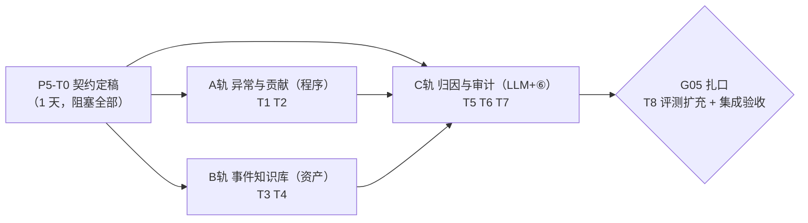

# Phase 05 规划：归因分析（P5-T0～T8）

> 目标一句话：报告从「发生了什么」走到「为什么」，但**结论强度分级、无证据不升级**——
> 这是 ideaV2 §四.5 明确后置至此的下一阶段主菜，也是**第一次让 LLM 产出「判断类」内容**，
> 四条硬约束边界的真正压力测试。新增一条不可破坏约束：**候选由程序给、LLM 只挑选与措辞**。
>
> 上位规划：`roadmap.md` §六。**与 Phase04 并行**：本阶段主战场在「pipeline 新增归因节点 +
> `report_event`/`report_claim` 资产与状态表 + ⑥ 第三类检查」，Phase04 在「④→⑥ 之间的图表节点 +
> 前端渲染」——文件面天然分离，交叉点仅 `report.html`（分区渲染：P5 只动归因章与 claim 证据链段）
> 与 ⑥ 审计包结构（各自追加独立段），合流前互跑对方 Gate 用例（对齐 phase04.md §五）。
> 工作模式承袭 phase02/03/04：T0 契约定稿（过目后开工）→ 三轨并行 → G05 扎口。预估单人 8～12 天
> （roadmap 最大单块）。

---

## 一、总体结构：一个启动节点、三条并行轨、一道闸口

A/B 两轨零 LLM 可先行并行；C 轨消费 A（ANOMALY fact）与 B（事件候选），排在两轨主体合入后。

**Gate G05 验收标准**（五条，源自 roadmap §六，全过才算完）：

1. **归因章节端到端**：周报/月报含「异动解读」章节，双卡点签发；无异动时章节输出「本期无显著异动」
   定性句（程序判定，非 LLM 自由发挥）。
2. **结论强度分级**：每条解释（claim）携带归因等级 `observed / associated / hypothesis` 与
   证据引用 `evidence_refs`（factKey 或 eventId），卡点2 可见完整 claim-证据链。
3. **无证据不编原因**：无事件候选时正文只说「待查」（如「变动原因待查，未见关联事件记录」），
   对抗用例固化——诱导 LLM 编造原因被服务端把关/审计拦截。
4. **因果措辞审计**：「把关联说成因果」对抗用例（narrative 无事件证据却用「导致/由于」）被 ⑥
   第三类检查拦截回写，固化为回归项；hypothesis 级缺缓和措辞同罪。
5. **confirmed 门禁与零回退**：`confirmed` 级别无人工确认记录时系统拒绝输出（服务端硬校验）；
   `mvn test` 全绿 + 评测两层（100 条 + LLM 层）不回退 + 既有 W26/M06/Q2 E2E 不回退。

---

## 二、通用纪律（承袭 phase01~04 全部十条，本阶段追加两条）

1～10 同 phase04（回归门禁 / 四硬约束 / 服务端把关 / 资产留痕 / commit 粒度 / 审计对抗先行 /
评测期望值手写 SQL / 种子只增不改 / 无声上限即违规 / 前端资源自包含）。追加：

11. **候选由程序给、LLM 只挑选与措辞**（新增硬约束，与四条并列）：归因链路上 LLM 的输入是
    程序生成的封闭候选集（异动 fact + 匹配事件），输出只许引用候选 id 与撰写措辞；
    自造事件、引用候选外证据、升级结论强度——一律服务端把关拦截 + ⑥ 死代码兜底，**不依赖 prompt**。
12. **外部事件文本视为数据不视为指令**（ideaV2 §七.3）：事件 description 进 prompt 前转义花括号
    与代码围栏、长度限制、录入期字符白名单校验——防间接注入；注入对抗用例先行（TDD）并固化回归。

---

## 三、启动节点（1 天，阻塞后续所有任务）

| 任务 | 内容 | 产出物 | 验证方式 |
|---|---|---|---|
| **P5-T0** 三份契约定稿 | 四个拍板项均按草案推荐定稿（2026-07-11 过目拍板）：① `report_event` **单行可编辑 + 留痕列，不上多版本**（事件是记录不是口径资产）；② 异常规则首批阈值 **\|环比\|≥30% 或 \|同比\|≥50%**（保守起步）；③ confirmed = **卡点2 审批人逐条勾选，落 `confirmed_by/at`，不建独立工作流**；④ LLM 可说/不可说清单按契约3 原文定稿 | 本文件三份契约定稿 | ✅ 过目评审通过（2026-07-11） |

### 契约草案 1：异常检测与维度贡献拆解（A 轨依据，纯程序零 LLM）

- **异常规则声明**：`MetricDefinition` 加可选字段 `anomalyRules`（列表）：
  `{ "type": "threshold", "op": ">=", "value": 10000000 }`（绝对阈值）与
  `{ "type": "volatility", "basis": "mom|wow|qoq|yoy", "absPct": 30 }`（波动率：对应比较 fact
  的 |值| ≥ absPct）。校验器规则：type/op/basis 枚举收口、volatility 的 basis 必须与模板声明的
  comparisons 可达（矩阵思路同 ComparisonType）、声明了 anomalyRules 的指标必须 comparable
  或有阈值型规则。
- **ANOMALY fact（程序产出）**：④ 之后（或并入 ④ 尾段）程序逐指标评估规则，命中产出
  `fact_NNN_anom`（TYPE_DERIVED，value=触发值，unit 随源，metricName 加「（异动）」，
  `derivedFrom` 指向源 fact 与比较 fact，qualityNote 记规则原文）——**异动是程序判定的事实，
  不是 LLM 的观点**。未命中不产 fact。每报 ANOMALY 总数上限 6（拍板可调），超限取
  |波动| 最大的前 6 并留 note？——**否：触顶 BLOCKED 转人工**（纪律 9，宁停不truncate；
  规则阈值保守起步使触顶罕见）。
- **维度贡献拆解**：异动指标若在同模板中存在对应维度指标（显式声明：`anomalyRules` 内可选
  `dimensionMetricId`），程序计算各维度行「变化贡献」：本期行值 −（比较基期行值，经该维度指标
  按基期窗口再取数）→ 贡献额与贡献占比 fact（`fact_NNN_anom_<slug>_contrib`）。
  维度指标本身仍禁 comparable（P3 约束不破）——基期行值由**贡献拆解通路**以 CHART/CONTRIB 专属
  purpose 取数，不走比较 fact 机制（细节 T2 落地，射程限贡献计算）。
- **失败关闭清单**：规则声明非法（校验期拦）、ANOMALY 超上限、贡献拆解基期取数失败——BLOCKED。

### 契约草案 2：事件知识库（B 轨依据，资产层）

- **表 `report_event`**（拍板项 ①，推荐简化形态）：
  `{event_id(自增), title(≤64), event_date(DATE), dimensions_json(可选，如 {"currency":"USD"}),`
  `related_metrics(可选，逗号分隔 metricId), description(≤500，白名单字符), source(≤128),`
  `status(ACTIVE/DEPRECATED), created_by/at, updated_by/at }`——事件是业务记录不是口径资产，
  不上多版本行不可变（与模板/指标的资产纪律区别开，文档里写明理由）；DEPRECATED 即下架不物理删。
- **页面化管理**：`event-admin.html`（照 template-admin 单文件范式）+ `EventAdminController`
  CRUD；录入校验（服务端）：日期合法、description 字符白名单（中英文、数字、常用标点；
  **禁 `{` `}` 反引号与代码围栏字符**）、长度限制——注入防御第一道闸。
- **进 prompt 前第二道闸**：EventMatcher 输出候选时对 title/description 再做转义 + 截断
  （防御纵深，不依赖录入校验）；候选以编号引用（`EVT-3`），LLM 只见编号+摘要。
- **种子事件**：`db/00-init.sql` 增量段（只增不改）造 3~5 条演示事件（如「2026-06 大客户回款」
  「2025-06 系统迁移致交易量低基数」），日期/维度与既有异动数据呼应，撑 E2E 与评测。

### 契约草案 3：分层归因与 ⑥ 第三类检查（C 轨依据，LLM 边界）

- **ClaimRecord 契约**：`{ claimId(cl_001), anomalyFactKey, attributionLevel(observed/associated/`
  `hypothesis/confirmed), evidenceRefs, narrative(≤200 字) }`，
  落新表 `report_claim`（run 级，重跑清空重建幂等，照 report_fact 范式）；报告正文「异动解读」章
  由 claim 渲染（每条：异动描述引用 fact 占位符 + narrative + 等级徽章 + 证据链）。
- **等级语义与上限（服务端把关，不信 LLM）**：
  - `observed`：仅陈述异动本身与维度贡献（证据=fact），无事件——**这是无事件候选时的唯一可用等级**，
    narrative 必须含「待查」语义句式；
  - `associated`：证据含关联 fact（贡献拆解/同向维度行），无事件；
  - `hypothesis`：证据含 ≥1 个事件候选，narrative 必须带缓和措辞（「可能/或与…有关/待验证」）；
  - `confirmed`：**LLM 永远不可产出**——仅当卡点2 审批人对某 hypothesis claim 显式勾选确认
    （拍板项 ③：落 `confirmed_by/at`），系统才将其升级；无确认记录的 confirmed 出现在任何输出 →
    服务端拒绝（Gate 第 5 条）。
- **管线接入**：⑤ 之前新增 `AttributionStep`（LLM 智能节点）：输入=程序打包的
  「异动 fact + 贡献 fact + EventMatcher 候选（编号化）」，输出=claim JSON 数组；
  **服务端把关**（照 OutlineStep 三段式范式）：evidenceRefs ⊆ 候选集、level 上限按证据类型推导
  （违规降级或 BLOCKED，不回灌自愈）、每报 claim 数 ≤ ANOMALY 数、narrative 长度；
  「异动解读」章的正文由 ⑤ 照 claim 组装（数字仍占位符，⑥ 双检照旧覆盖）。
- **EventMatcher（程序）**：时间窗（event_date ∈ 报告期或比较基期窗口）+ 维度交集
  （事件 dimensions ∩ 异动指标维度贡献的 top 维度值）+ related_metrics 命中——三条件加权排序，
  候选 ≤5 条/异动；零候选=零候选（不放宽阈值凑数——失败关闭精神）。
- **⑥ 第三类检查 `CausalityAuditor`**（照 NumberAuditor 范式：纯静态、可单测、死代码兜底）：
  - 因果措辞词典（导致/由于/因为/引发/使得/造成/归因于）扫描终稿「异动解读」章：出现在无事件
    证据（evidenceRefs 不含 EVT）的 claim 段落内 → 违规回灌重写（沿用 max-rewrite-rounds）；
  - hypothesis 级 claim 的 narrative 缺缓和措辞词（可能/或/待验证/有待）→ 违规；
  - 正文出现候选集外的事件性描述（启发式：引号内专名 + 事件动词，宁漏报不误报）→ 违规；
  - **对抗语料单测先行 ≥15 条**（纪律 6）：把关联说成因果、编造事件、confirmed 伪造、
    注入事件 description 携带指令等逐条命中；合法语料 ≥15 条零误伤。
- **LLM 可说/不可说清单**（拍板项 ④，进 AttributionStep system 铁律 + 上述死代码双保险）：
  可说——候选内事件与异动的时间/维度关联、以缓和措辞表述假设、维度贡献的定性转述；
  不可说——候选外任何事件/原因、确定性因果断言、confirmed 等级、任何阿拉伯数字与中文数量表达
  （数字纪律与 ⑤ 同源，⑥ 双检照旧射程覆盖归因章）。

---

## 四、并行 A 轨：异常检测与贡献拆解（T1→T2 顺序，纯程序）

| 任务 | 内容 | 产出物 | 验证方式 |
|---|---|---|---|
| **P5-T1** 异常规则引擎 | 按契约1：`MetricDefinition.anomalyRules` + 校验器规则（含 basis-comparisons 矩阵）；规则评估器（纯静态可单测）产 `fact_NNN_anom`；每报 ANOMALY 上限触顶 BLOCKED；首批规则按拍板阈值挂到 2~3 个种子指标（发新版走资产通路） | 规则引擎 + 校验 + 单测 | 单测：阈值/波动/上限正反例；评测确定性层 100 条不回退 |
| **P5-T2** 维度贡献拆解 | 按契约1：`dimensionMetricId` 声明 + 贡献计算（基期维度行取数专属通路）+ 贡献 fact；贡献占比与 top 维度值供 EventMatcher/叙述引用 | 贡献计算 + 单测 | 单测：贡献额/占比/缺基期失败关闭；查库贡献 fact 齐全 |

## 五、并行 B 轨：事件知识库（T3→T4 顺序，资产）

| 任务 | 内容 | 产出物 | 验证方式 |
|---|---|---|---|
| **P5-T3** report_event 表与页面 | 按契约2：建表（db/01 或独立 03 脚本 + 守卫式）+ `EventAdminService/Controller` CRUD + `event-admin.html`；录入白名单校验与长度限制；**注入对抗用例先行**（description 携带「忽略以上指令…」/花括号/围栏 → 录入被拒或转义后无害化）；种子事件增量（纪律 8） | 表 + 页面 + 单测 | 实操录入/下架；注入语料单测全绿 |
| **P5-T4** EventMatcher 候选生成 | 按契约2/3：时间窗 + 维度交集 + related_metrics 三条件匹配排序，候选 ≤5/异动；输出编号化候选包（转义 + 截断第二道闸） | 匹配器（纯逻辑可单测） | 单测：三条件命中/排序/零候选/转义 |

## 六、并行 C 轨：归因与审计（T5→T6→T7，等 A/B 主体合入）

| 任务 | 内容 | 产出物 | 验证方式 |
|---|---|---|---|
| **P5-T5** AttributionStep + ClaimRecord | 按契约3：`report_claim` 表 + AttributionStep（LLM 候选内单选与措辞）+ 服务端把关（evidenceRefs ⊆ 候选、level 上限推导、数量上限）；claim 进 ⑤ 的章节组装 | 新 Step + 表 + 把关 + 单测 | 单测：把关正反例（候选外引用/等级越权被拦）；E2E 草稿含 claim 章 |
| **P5-T6** CausalityAuditor 接入 ⑥ | 按契约3：因果词典/缓和措辞/候选外事件启发式三类扫描，违规回灌重写沿用 max-rewrite-rounds；**对抗语料 ≥15 + 合法语料 ≥15 单测先行**（纪律 6）；stylePrompt 诱导「把关联写成因果」新增注入回归项 | Auditor + 单测 | 单测全绿；实弹注入演练被拦实录 |
| **P5-T7** 章节接入与卡点2 证据链 | 周报/月报模板发新版加「异动解读」章（无异动时程序定性句）；`report.html` 归因分区：claim 列表 + 等级徽章 + 证据链钻取（fact 链到证据表、EVT 链到事件详情）+ confirmed 勾选（拍板项 ③） | 模板新版 + 前端 | **E2E**：含异动的周期签发，claim-证据链可钻取；无异动周期输出定性句 |

## 七、合流与扎口

| 任务 | 内容 | 验证方式 |
|---|---|---|
| **P5-T8** 评测扩充与 G05 扎口 | golden-set 扩：归因对抗用例（BLOCKED 类新增「诱导编因」变体 + LLM 层新类别 CLAIM：期望等级/期望「待查」）；确定性层补 ANOMALY/贡献 fact 期望值（手写 SQL）；Gate 五条逐条验收；README（演示补录 + 基线更新）+ 验收记录入本文件 §九 + tag `phase05-G05`；与 Phase04 合流互跑对方 Gate 用例 | Gate 全过；`mvn test` 全绿；两层评测不回退 |

---

## 八、主要风险与缓解

| 风险 | 缓解 |
|---|---|
| **LLM 越权产判断**（本阶段最大风险） | 纪律 11 候选制（输入封闭）+ 服务端 level 上限推导（输出封闭）+ CausalityAuditor 死代码 + 对抗 TDD——四层防御，任何一层不依赖 prompt |
| 事件库成注入面 | 纪律 12 双闸（录入白名单 + 进 prompt 转义截断）；注入对抗用例 T3 先行固化 |
| 异常规则误报刷屏 / 归因章冗长 | 阈值保守起步（拍板项 ②）；ANOMALY ≤6、候选 ≤5/异动、claim ≤ ANOMALY 数、narrative ≤200 字——全部触顶 BLOCKED 不截断 |
| confirmed 机制过度设计 | 拍板项 ③ 最小化：卡点2 勾选 + 两列留痕，不建独立工作流；Phase06 角色体系落地后再演进 |
| 与 Phase04 并行 report.html 冲突 | 分区渲染约定（本文件 §引言 + phase04.md §五 互引）；合流前互跑对方 Gate 用例 |
| 贡献拆解的基期取数绕开比较 fact 机制造成口径分叉 | T2 专属 purpose 射程限贡献计算、同走 ③ 确定性通路（同校验同哈希留痕）；文档显式说明与 P3「维度禁 comparable」的边界 |
| 归因章数字纪律松动 | claim narrative 与异动描述的数字仍走 {{fact_key}} 占位符——⑤⑥ 既有双检射程天然覆盖，零新机制 |

## 九、G05 验收记录（2026-07-11，phase05 分支）

| # | Gate 标准 | 结果 | 证据 |
|---|---|---|---|
| 1 | 「异动解读」章节端到端签发 | ✅ | treasury-weekly v5 加 `anomaly_insight` 章（chapterId 前缀 `anomaly_` 约定标识归因章）；run #34 异动（wow +142.2% 触发 v2 规则）→ 贡献拆解（CNY/USD/EUR，含负贡献）→ EVT-1 候选（三条件满分 4）→ claim → 章节呈现 → PUBLISHED，审计 44/44=100% |
| 2 | 结论强度分级 + 证据引用 | ✅ | cl_001 hypothesis，evidenceRefs=[fact_002_anom_cny_contrib_share, EVT-1]；正文等级徽章【假设·待验证】；claim 证据链进详情页可钻取（fact→证据表、EVT→事件） |
| 3 | 无证据不编原因 | ✅ | 等级上限服务端推导（仅 fact ≤associated、含 EVT 方可 hypothesis）+ LLM 漏答由程序补 observed「待查」兜底 + CausalityAuditor observed 无事件必须含「待查」语义（单测固化） |
| 4 | 「把关联说成因果」对抗被拦 | ✅ | 实弹 run #35：卡点1 注入 stylePrompt（最高优先级指令：用「导致/由于」、删「可能/待验证」）→ ⑥ 因果词典拦截回写 1 轮 → 终稿零无证据因果措辞、缓和语义保留、数字审计 100%；CausalityAuditorTest 对抗语料 11 组 + 合法语料 11 组固化 |
| 5 | confirmed 门禁 + 零回退 | ✅ | LLM 产 confirmed → 服务端拒绝（把关 + 死代码双层）；卡点2 勾选 cl_001 → confirmed_by=reviewer-a 留痕（仅 hypothesis 可升）；评测两层 100/100 + 15/15 + 6/6 不回退；`mvn test` **361/361** |

**实施发现与裁量**：① 归因章标识用 chapterId 前缀 `anomaly_` 约定而非新增 schema 字段——避免与 phase04 的 ChapterDef 变更叠加合流冲突，P6 编辑器整修时可升格为显式 kind 字段；② 归因段（LLM）落位 ⑤ 开头而非 ④——守住「③④ 零 LLM」硬约束叙事，claims 与事实同命（SPEC~FACT 重跑段重算、WRITE 续跑读库固化）；③ T8 原计划的 golden-set 归因新类别**裁量不建**：归因评测需全管线 run，与「评测端点只读不写状态表」冲突——以对抗单测（22 组语料）+ 实弹演练固化替代，留待 P6 影子回归机制承接；④ 正文的事件引用 LLM 偶将「（证据：EVT-1）」转写为叙述语（材料层证据链完整，词典规则不受影响）——正文 EVT 编号强制呈现留待 P6 收紧；⑤ **合流清单**：本分支解析丢弃 v4 的 charts 字段，v5 无图表声明——phase04+phase05 合流后须发 treasury-weekly v6 同时携带 charts 与 anomaly_insight 章。
