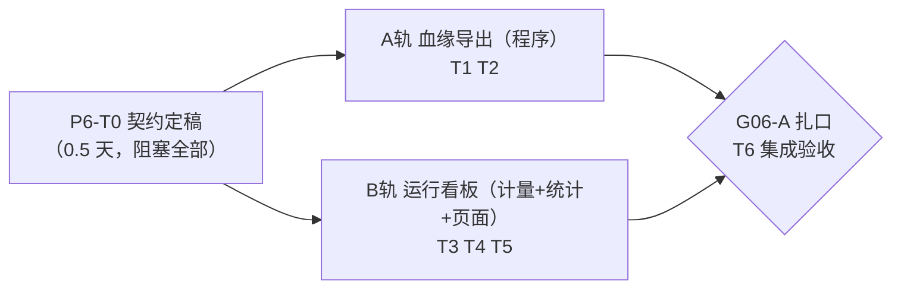

# Phase 06 规划（第一批：血缘与看板，P6-T0～T6）

> 目标一句话：让每一次运行都能**一键交出「从需求到审批」的完整血缘档案**（对齐 OpenLineage
> 概念、不引重框架），让运营者在**看板**上一眼看到流水线的健康度与成本——观测层**绝对只读**，
> 不碰六步流水线的任何一步。
>
> 上位规划：`roadmap.md` §七。**范围裁剪（本批次拍板）**：Phase06 四个工作块中本批**仅做
> 「血缘与看板」**；「角色与审批」「资产变更影子回归」「日志与脱敏」三块与组织形态强相关，
> 留待立项转生产时作为后续批次启动（届时另起 G06-B/C）。本批 Gate 记 **G06-A**。
>
> 有利条件：留痕地基已齐——`report_step` 自带 `started_at/finished_at/attempt/status`
> （耗时/重试/阻断可直接算，**零表结构改动**）；run 明细已有完整链路（需求→模板版本+指标版本
> 快照→spec→SQL（sql_hash）→fact（result_hash）→图表→claim→审批）。唯一缺口是 LLM token
> 计量（`LlmClient` 目前丢弃响应 usage 段），列为 T0 拍板项 ②。
> 工作模式承袭 phase02~05：T0 契约定稿（过目后开工）→ 两轨并行 → G06-A 扎口。预估单人 3~5 天。

---

## 一、总体结构：一个启动节点、两条并行轨、一道闸口

A/B 两轨文件面天然分离（A 在 `report/lineage/`，B 在 `report/observe/` + 一个新静态页），
可完全并行；交叉点仅 README 与导航条，扎口时合并。

**Gate G06-A 验收标准**（五条，全过才算完）：

1. **血缘导出端到端**：任一 run（含 BLOCKED）可 `GET /api/report/runs/{id}/lineage` 得到
   完整血缘 JSON（对齐 OpenLineage 的 job / run / dataset / facet 命名概念，**不引框架**）；
   节点覆盖：需求文本 → 模板版本 + 指标版本快照 → spec → SQL（sql_hash）→ fact（result_hash）
   → 图表（boundFactKeys）→ claim（含事件引用）→ 双卡点审批（人/时间）；schema 文档化入 README。
2. **同源与失败关闭**：血缘字段一律取自库中留痕，装配器**不现算、不补猜**；遇断链
   （有引用、无实体）明确报错，不出「半份血缘」；PUBLISHED run 的血缘必含审计包摘要（一致率、
   图表核对、重写轮次）。
3. **运行看板可用**：`dashboard.html` 展示时间窗内——各步成功率 / 重试率 / 阻断率（按 phase
   聚合）、P50/P95 步耗时、LLM 调用次数与 token 用量（及可选成本估算）、BLOCKED 原因按
   `[POLICY]/[EXCEPTION]` 分组的 TopN；数据全部来自只读统计端点。
4. **token 计量落痕**：报告链路每次 LLM 调用（①大纲 / ⑤撰写 / 归因挑选 / ⑥回灌重写）的
   usage 随 step 留痕，可按 run 与时间窗聚合；旧 run 无计量显示「未计量」，不冒充零。
5. **零回退与零写入**：`mvn test` 全绿；评测两层（105/105 + 15/15 + 6/6）不回退；观测层对
   状态表**零写入**（唯一例外：step 留痕上新增的 usage 字段，由流水线自己写）；既有 E2E 不受影响。

---

## 二、通用纪律（承袭 phase01~05 全部十二条，本阶段追加两条）

1～12 同 phase05（回归门禁 / 四硬约束 / 服务端把关 / 资产留痕 / commit 粒度 / 审计对抗先行 /
评测期望值手写 SQL / 种子只增不改 / 无声上限即违规 / 前端资源自包含 / 候选由程序给 /
事件文本视为数据）。追加：

13. **观测层绝对只读**：血缘导出与看板统计只 SELECT，不产生任何状态迁移、不回写任何业务/状态/
    资产表；不给六步流水线增加任何前置依赖——观测层整体宕掉，报告照常出。
14. **血缘同源、断链失败关闭**：血缘 JSON 的每个字段都必须能指回一行库中留痕；装配遇到
    「引用存在、实体缺失」即失败关闭（这是在给留痕完整性做体检）；「老 run 天然没有的产物」
    （如 P4 前的 run 无图表）是**合法空**，标注 absent，与断链严格区分。

---

## 三、启动节点（0.5 天，阻塞后续所有任务）

| 任务 | 内容 | 产出物 | 验证方式 |
|---|---|---|---|
| **P6-T0** 三份契约定稿 | 四个拍板项**均按推荐定稿（2026-07-11 过目拍板）**：① 血缘格式与粒度——**run 级单文档**（`{job, run, inputs, outputs, graph:{nodes,edges}}`，fact 级明细内嵌为 edges），不做 OpenLineage 事件流；② token 计量口径——**真实 usage**：`LlmClient` 非破坏性追加 detail 方法（返回内容+usage，既有 `chat` 签名不动、底座评估契约不受影响），报告层调用点采集、以 `usage` 段内嵌 step `output_json`（**不加列**）；③ 看板统计窗口——**默认近 30 天 + 可切全量**，页面手动刷新不轮询；④ 成本单价形态——**`application.yml` 配置**（输入/输出每千 token 单价，缺省 0 = 只显示 token 不显示金额） | 本文件三份契约定稿 | ✅ 过目评审通过（2026-07-11） |

### 契约草案 1：血缘模型（A 轨依据，纯程序零 LLM）

- **端点**：`GET /api/report/runs/{id}/lineage`（只读；run 不存在 → 404，装配断链 → 400 带断点明细）。
- **顶层结构**（对齐 OpenLineage 概念的命名，不引其 SDK/事件协议）：
  - `job`：`{ templateId, templateVersion, templateName }`——报告模板即「作业定义」；
  - `run`：`{ runId, status, periodLabel, 三套窗口, requestText, blockedReason? }`；
  - `inputs[]`（dataset）：业务表清单——**从 fact 的 `spec_json` 内嵌 MQL 结构化提取**
    （`table` + `joins[].table`，绝不解析 SQL 文本）+ 资产输入（指标版本快照逐条、事件引用）；
  - `outputs[]`（dataset）：`report_md`（PUBLISHED 时）、facts、charts、claims；
  - `graph.nodes[]`：`{ nodeId, type, label, facets{} }`，type 枚举
    `REQUIREMENT / TEMPLATE / METRIC / SPEC / SQL / FACT / CHART / EVENT / CLAIM / APPROVAL / REPORT`；
  - `graph.edges[]`：`{ from, to, type }`，type 枚举
    `MATCHED_TO（需求→模板）/ RESOLVED_TO（模板→spec）/ COMPILED_TO（spec→SQL）/
    PRODUCED（SQL→fact）/ DERIVED_FROM（fact→fact，环比/同比/异动/贡献沿 derivedFrom 展开）/
    BOUND_TO（fact→chart，沿 boundFactKeys）/ EVIDENCED_BY（claim→fact|event）/
    APPROVED_BY（report→审批节点，卡点1/2 各一）`。
- **facets**（挂在对应节点上）：fact 节点带 `sqlHash / resultHash / displayValue / qualityStatus`；
  REPORT 节点带审计包摘要（`totalNumbers / matchedNumbers / rewriteRounds / chartChecks 汇总`）；
  METRIC 节点带版本号（取自 run 的 `metric_versions_json` 快照，**不取当前 PUBLISHED**）。
- **装配器** `LineageAssembler`（`report/lineage/`，纯静态可单测）：输入 run + steps + facts +
  claims + charts（全部既有仓库回读），输出上述文档；断链失败关闭（纪律 14），合法空标 `absent`。

### 契约草案 2：步骤计量与 token 采集（B 轨依据，看板数据地基）

- **既有列直接用**：步耗时 = `finished_at - started_at`；重试率 = 同 (run,phase) 内 `attempt>1`
  的占比；阻断率 = `status='BLOCKED'` 步占比；全部按 phase 聚合，**零表结构改动**。
- **token 采集**（按拍板项 ② 定稿口径）：`LlmClient` 追加
  `ChatDetail chatDetail(List<Message>)`（default 实现委托既有 `chat` 且 usage 为 null——
  供应商不返回 usage 时同样落 null）；`OpenAiCompatibleLlmClient` 覆写解析
  `usage.prompt_tokens / completion_tokens`。报告层四个调用点（OutlineStep / WriteStep /
  AttributionStep / AuditStep 回灌重写）切换到 detail 方法，把
  `{"usage":{"promptTokens":N,"completionTokens":M}}` 段合入该步 `output_json`。
  **底座约束**：只追加不修改——`chat` 既有签名与行为不动，`Nl2SqlService.query()` 与
  `EvalService` 零感知；金标准评测回归兜底。
- **成本估算**：`report.observe.price-per-1k-input / -output`（默认 0）；看板金额列仅在
  单价非零时显示，并标注「估算」。

### 契约草案 3：统计端点与看板页（B 轨依据）

- **端点**：`GET /api/report/stats?from=&to=`（缺省近 30 天；只读），返回：
  `runs`（总数、按状态分布、BLOCKED 原因 `[POLICY]/[EXCEPTION]` 分组 TopN——取
  `blocked_reason` 前缀与首句）；`steps[]`（按 phase：执行次数、成功率、重试率、阻断率、
  P50/P95 耗时毫秒——分位数在 Java 内存排序算，演示量级足够）；`llm`（调用次数、prompt/
  completion token 合计、估算成本?）。
- **页面**：`resources/static/dashboard.html`（单文件 vanilla JS，照 report.html 范式），
  图表复用 **vendored ECharts**（禁 CDN，纪律 10）：状态分布饼图、各步成功率柱状、P50/P95
  条形、token 走势可后置；导航条加「📊 运行看板」入口（各静态页同步）。
- **统计服务** `RunStatsService`（`report/observe/`）：SQL 聚合 + Java 分位数，纯读；
  单测用固造 step 行逐值验证成功率/重试率/分位数（不依赖 DB 的用内存行集）。

---

## 四、并行 A 轨：血缘导出（T1→T2 顺序，纯程序）

| 任务 | 内容 | 依赖 | 验证方式 |
|---|---|---|---|
| **P6-T1** LineageAssembler | 契约 1 的装配器与节点/边模型；DERIVED_FROM 沿 `derivedFrom` 逗号链展开；BOUND_TO 沿 `boundFactKeys`；EVIDENCED_BY 区分 fact 与 EVT 引用；断链失败关闭 + 合法空 absent 标注 | T0 | 纯逻辑单测：完整 run 固造数据出全图；抽掉一个被引用 fact → 明确报错；老 run（无 charts/claims/版本快照）→ absent 不报错 |
| **P6-T2** 端点 + 文档 + 实导 | `/runs/{id}/lineage` 端点（404/400 语义照控制器范式）；README 新节「血缘导出」附 schema 说明与示例；对库中真实 run 实导核验：run#37（PUBLISHED 全能力：图表+归因+同比）与一个 BLOCKED run 各一份，人工核对节点/边与页面证据一致 | T1 | 实导 JSON 逐段核对：fact 数、边数与库中行数吻合；sql_hash 与凭证页一致 |

## 五、并行 B 轨：运行看板（T3→T4→T5 顺序）

| 任务 | 内容 | 依赖 | 验证方式 |
|---|---|---|---|
| **P6-T3** token 计量落痕 | 按 T0 拍板口径实现 `chatDetail` + 四个调用点采集入 `output_json`（守卫式：usage 为 null 不写段）；底座只追加不修改 | T0 | `mvn test` 全绿 + 金标准评测不回退；跑一份真实周报，四步 output_json 均见 usage 段 |
| **P6-T4** RunStatsService + /stats | 契约 3 的聚合服务与端点；BLOCKED 原因分组解析；P50/P95 Java 分位数；时间窗过滤 | T3 | 单测固造行集逐值验证；对库中历史 run 实跑，与手写 SQL 聚合抽查一致 |
| **P6-T5** dashboard.html | 契约 3 的看板页 + 导航条入口（全部静态页同步加）；无数据/未计量的空态文案 | T4 | 浏览器实测：数字与 /stats 返回一致；旧 run 的 token 列显示「未计量」 |

## 六、合流与扎口

| 任务 | 内容 | 依赖 | 验证方式 |
|---|---|---|---|
| **P6-T6** G06-A 扎口 | 全量回归（mvn test + 评测两层 + 既有 E2E 一份周报全流程）；README 观测能力节收口；本文件补验收记录；合入 master 打 tag `phase06-G06A` | T2 T5 | Gate 五条逐项核验通过 |

## 七、主要风险与缓解

| 风险 | 缓解 |
|---|---|
| 从 SQL 文本反推表名不可靠（别名/子查询） | 血缘的业务表输入**只从 spec_json 的 MQL 结构取**（table + joins），SQL 文本仅作 facet 附带展示，不做解析 |
| 老 run 结构性缺失把血缘搞成「处处报错」 | 纪律 14 的双态设计：断链（有引用无实体）才失败关闭；能力引入前的老 run 产物缺失是合法空 `absent`——T1 单测两态都固化 |
| 供应商不返回 usage / 换供应商字段漂移 | usage 可空贯穿全链：采集点判空不写段、聚合端把「未计量」与 0 区分展示；成本仅在配置单价后显示并标「估算」 |
| 动 `LlmClient` 破坏底座评估契约 | 只追加 default 方法不改既有签名；`query()`/`EvalService` 零改动；金标准评测纳入 T3 验证项 |
| 观测聚合查询拖慢主库 | 时间窗缺省 30 天 + 复用既有 `idx_step_run`；演示量级无压力；物化/独立读库是生产化话题，明确不在本批 |
| 看板被误会成「实时监控」 | 页面明示「手动刷新、演示级统计」；不做轮询、不做告警——那是 G06-B 之后的事 |
