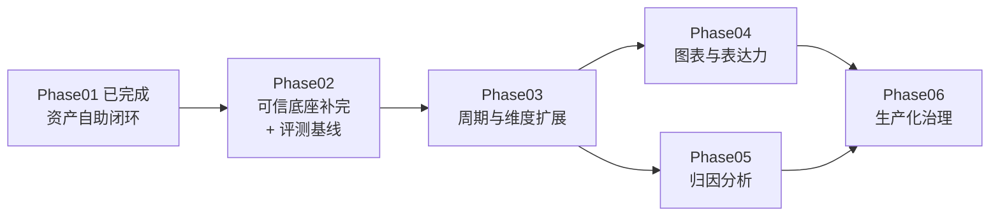

# 后续阶段总体规划（Roadmap：Phase02 → Phase06）

> 定位一句话：Phase01 已交付「多报告、多场景、页面全控制」的资产自助闭环（GF 实录 run #23）；
> 本文回答**接下来做什么、按什么顺序做、为什么是这个顺序**——先补齐可信闭环的已知欠账并建立评测基线，
> 再扩表达力（周期/维度/图表），然后攻分析深度（归因），最后做生产化治理。
>
> 与 phase01.md 的关系：编号续用（Phase02 起），工作模式承袭（每阶段 T0 契约定稿 → 多任务并行 → Gate 扎口验收）；
> 本文只做**总体路线与各阶段概要**，每个阶段开工时另立 `phaseNN.md` 细化任务表（Phase02 已在本文细化到任务粒度，可直接开工）。

---

## 一、现状盘点（Phase01 完成态，2026-07-08）

**已有能力**：6 步流水线双卡点闭环（数字一致率 100% 硬门禁）；多模板运行期匹配（三段式，失败关闭）；
模板/指标页面化全生命周期管理（版本化、行不可变、发布事务）；AI 起草模板 + 指标五步向导 + 制作回跳联动；
stylePrompt 章节风格（注入攻击已固化为回归项）。库中资产：5 个 PUBLISHED 模板、18 个 PUBLISHED 指标；241 个纯逻辑单测。

**已知欠账**（来源：技术说明书 12.2「刻意留的接口」/ 12.3「还没建的机械」+ ideaV2 后置项），按性质归四类：

| 类别 | 欠账 | 出处 | 影响 |
|---|---|---|---|
| **可信度**（承诺没兑现满的部分） | run 固化指标版本（模板已固化、指标未固化——指标发新版时在跑 run 存在口径漂移理论窗口） | 12.3 / 说明书 9.5 诚实说明 | 复现性承诺有缺口 |
| | 中文数词审计盲区（「三成」「上百万」不在 ⑥ 射程，靠 prompt 禁用 + 人工兜底） | 12.3 / 说明书第 7 章 | 审计死代码有盲区 |
| | 规模化评测基线缺失（回归需求集、取数等价率基线都没有；资产已能自助扩容，此项优先级被动抬高） | 12.3 / ideaV2 §八 | 资产扩容质量无法度量 |
| | 行文量词重复（「4 笔笔」，prompt 缓解，根治需替换后处理） | 12.3 | 文风瑕疵，不伤数字 |
| **表达力**（报告只能说这么多） | 仅支持 ISO 周（月报/季报被失败关闭）；`PeriodResolver` 已预留日历规则扩展点 | 12.2 | 演示 11 即此限制 |
| | 维度展开未启用（`FactRecord.dimensions` 契约与库表已就位、恒为空；「按币种拆」是填充不是改结构） | 12.2 | 报告无结构分析 |
| | 无图表（ideaV2 步骤 8 的 ECharts 配置生成整体未做） | ideaV2 §五 | 正式报告需要图 |
| | 口径资产升格入口未接（wizard `?mql=` 参数已预留） | 12.2 / P5-T6 | 引擎沉淀复用断点 |
| **分析深度** | 只说「发生了什么」，不说「为什么」——异常检测、事件知识库、分层归因（observed/associated/hypothesis/confirmed）、ClaimRecord 全部后置 | 12.3 / ideaV2 §四.5 | 设计文档明确的下一阶段 |
| **生产化治理** | 角色与审批人体系（现在 approver 是自填字符串）、资产变更影子运行/灰度、血缘导出、运行看板与成本统计、日志脱敏 | ideaV2 §七/§九/阶段2 | 立项转生产的门槛 |

---

## 二、总体路线：四条主线、五个阶段

**排序原则**：
1. **先还可信债，再扩能力**——「数字一致率 100%」是全部卖点的地基，已知盲区（指标版本、中文数词）必须在扩容前补上；
2. **评测基线前置**——Phase01 让资产可以页面自助扩容，没有回归评测集，后面每一步扩展都在裸奔；
3. **表达力先于分析深度**——归因需要维度拆解（贡献分析按维度算）与更多周期（同比需要月/年口径），Phase03 是 Phase05 的地基；
4. **治理殿后但不缺席**——本项目仍是预研演示，治理项（Phase06）在「立项转生产」时可整体提前。

| 阶段 | 主题 | 强依赖 | 可并行性 | 预估（单人） |
|---|---|---|---|---|
| **Phase02** | 可信底座补完 + 规模化评测基线 | — | 内部三轨并行（版本固化 / 审计补盲 / 评测集） | 4～6 天 |
| **Phase03** | 周期与维度扩展（月报/季报、维度拆解） | P2（评测基线护航 schema 变更） | 内部周期轨与维度轨并行 | 5～8 天 |
| **Phase04** | 图表与表达力（ECharts 零 LLM 数据绑定、全局编辑） | P3（图表要画的正是多周期序列与维度拆解） | **与 Phase05 并行**（不同文件面） | 4～6 天 |
| **Phase05** | 归因分析（异常检测、事件知识库、分层归因、ClaimRecord） | P3（贡献拆解按维度算） | 与 Phase04 并行 | 8～12 天 |
| **Phase06** | 生产化治理（角色审批、资产变更影子回归、血缘与看板） | P2 评测集（影子回归的弹药） | 多数任务独立可并行 | 6～10 天 |

**总量级：单人串行约 27～42 个工作日。** 每阶段 Gate 通过后打阶段 commit 标记，
重大能力（P3 月报、P5 归因）落地后同步升级技术说明书版本。

### 全程通用纪律（承袭 phase01.md §二，全文有效）

1. **回归门禁**：任何任务合入前 `mvn test` 全绿 + 基线 E2E 不回退（2026-W26 司库周报一致率 100%）；Phase02 之后追加「评测集通过率不回退」。
2. **四条硬约束不松动**：③ 零 LLM 确定性、⑤ 禁写数字、⑥ 死代码兜底、失败关闭——任何新能力（图表、归因、维度）都必须在这四条框架内实现，**新增的 LLM 环节只许选择与措辞，不许产生数字与因果结论**。
3. **服务端把关、资产变更留痕、commit 粒度**：同 phase01。
4. **每阶段开工先出 T0 契约**（半天内定稿、过目后开工），契约不定稿不开工。

---

## 三、Phase02　可信底座补完 + 规模化评测基线（可直接开工）

**目标**：把说明书里两处「诚实说明」的盲区（指标版本漂移窗口、中文数词射程）关掉，
把「资产可自助扩容但质量无法度量」的裸奔状态终结——建立报告层回归评测基线。
**Gate G02 验收标准**：① 指标发新版后，在跑/续跑的旧 run 仍用固化版本（对比 SQL 证明）；
② 中文数词对抗用例（「约三成」「上百万」）被 ⑥ 拦截回写；③ 评测集全量跑通并产出基线数字
（取数等价率 / 数字一致率 / 匹配正确率 / 失败关闭正确率），写入 README；④ 全量单测与基线 E2E 不回退。

### 启动节点（半天）

| 任务 | 内容 | 产出物 | 验证方式 |
|---|---|---|---|
| **P2-T0** 契约定稿 | 定三件事：① 指标版本固化的落点（run 表 JSON 快照列 vs `report_fact` 加 `metric_version` 列，含 resume 语义）；② 中文数词解析器的射程与白名单（哪些中文数字合法：周期标签「第26周」、「周三」等）；③ 评测集 schema（需求文本 + 期望模板 id + 期望 BLOCKED 与否 + 逐指标期望值/期望 sql_hash）与分层运行方式（确定性层可 CI、LLM 层手动触发） | 契约附注（本文附录或 phase02.md） | 过目评审通过 |

### 并行 A 轨：指标版本固化

| 任务 | 内容 | 产出物 | 验证方式 |
|---|---|---|---|
| **P2-T1** 固化落库 | 卡点1 确认时snapshot「metric_id → version」映射入 run；`FetchStep`/`FactBuildStep` 按固化版本从仓库取定义（`findById+version` 已有）；`report_fact` 记录 metric_version | ALTER 迁移 SQL + 代码 | 单测 + 查库确认 |
| **P2-T2** 续跑与展示闭环 | resume 一律用固化版本（对齐 P4-T2 模板同款语义）；run 详情页展示各指标版本徽章 | Pipeline 小改 + 页面 | 发指标新版 → resume 旧 run → SQL 与固化版一致 |

### 并行 B 轨：审计补盲与行文后处理

| 任务 | 内容 | 产出物 | 验证方式 |
|---|---|---|---|
| **P2-T3** 中文数词解析器 | 纯逻辑解析器：识别中文数字（零～亿）+ 量级词（成/倍/半/上百/近千…）；白名单放行合法用法（周期标签、星期、序数章节名） | `ChineseNumeralDetector`（可独立单测） | 单测：对抗语料逐条命中，白名单不误伤 |
| **P2-T4** 接入 ⑥ 检查1 | 草稿禁数扫描扩展：阿拉伯数字 + 中文数词皆违规 → 回灌重写（沿用 max-rewrite-rounds） | AuditStep/NumberAuditor 改动 | 对抗演练：stylePrompt 诱导「用中文数字写三成」被拦，固化为回归项 |
| **P2-T5** 量词去重后处理 | ⑥ 替换 display_value 后，确定性后处理去重占位符后重复量词（「4 笔笔」→「4 笔」） | 后处理函数（可单测） | 单测：典型重复消除、正常文本零改动 |

### 并行 C 轨：评测基线

| 任务 | 内容 | 产出物 | 验证方式 |
|---|---|---|---|
| **P2-T6** 黄金需求集 | 20～30 条真实需求：常规问法、口语变体、时间边界、匹配歧义、应 BLOCKED 的反例（HR 盘点/月报/空泛描述）、含新制作指标的场景 | `resources/report/eval/golden-set.json` | 评审：覆盖 ideaV2 §八.2 的核心类别 |
| **P2-T7** 评测 harness | 分层评测：**确定性层**（②③④⑥：spec→SQL→结果 vs 期望 hash/值，无 LLM 可进 CI）+ **LLM 层**（①匹配正确率、⑤ 平均重写轮数，手动触发）；产出评测报告（JSON + 控制台摘要） | 评测 runner（照底座 `EvalService` 范式）+ 端点或 CLI | 全量跑通、基线数字落 README |
| **P2-T8** 口径资产升格入口 | 引擎 `caliber_asset` 列表加「升格为指标」按钮 → 带 MQL 跳 wizard 第 ③ 步（`?mql=` 已预留）（P5-T6 遗留小任务，顺手关掉） | 页面联动 | 实操：口径沉淀 → 一键进向导 → 落库为指标 |

### 扎口

| 任务 | 内容 | 验证方式 |
|---|---|---|
| **P2-T9** G02 集成验收 | 三轨合流跑全量评测 + 两项对抗演练（指标版本漂移、中文数词注入） | Gate 四条标准全过；评测基线数字写入 README 与说明书 |

---

## 四、Phase03　周期与维度扩展（概要，开工时出 phase03.md）

**目标**：报告从「仅 ISO 周」扩展到月报/季报，事实从「单值」扩展到「按维度拆解的多行」。
**Gate G03 验收标准**：「生成 2026 年 6 月资金月报」端到端签发（演示 11 的 BLOCKED 变为能力）；
周报含「按币种拆解」章节且每行数字审计 100%；评测集扩充月报/维度用例后全量通过。

主要工作块（开工时细化为 T 任务）：

- **周期轨**：`PeriodResolver` 增加月/季日历规则与周期标签（`2026-M06`/`2026-Q2`）；`comparison` 扩展 `month_over_month`（及同比 `year_over_year`，视种子数据覆盖决定是否此阶段做）；模板 schema 与校验器声明适用周期类型；需要月报种子模板 + 种子数据核查（现覆盖 2026-05-12~06-30，够 M05/M06 环比）。
- **维度轨**：指标定义声明可展开维度 → MQL 模板含 groupBy → ③ 返回多行 → ④ 逐行造 fact（`dimensions` 字段终于非空）+ 程序算占比/排序 DERIVED fact → ⑤ 以表格/列表占位符呈现 → ⑥ 审计覆盖多行逐格核对。**契约与库表不动，是填充**。
- **风险预判**：多行 fact 使 fact_key 空间膨胀、⑤ 的占位符纪律更难守——T0 需定 fact_key 命名规约与章节内 fact 数上限；审计器逐格核对是现成逻辑的循环化，硬约束不变。

预估 5～8 天，内部两轨可并行。

## 五、Phase04　图表与表达力（概要；与 Phase05 并行）

**目标**：报告带图，且图表数据与 fact 同源同审计——把「每个数字有出生证明」延伸到「每张图有出生证明」。
**Gate G04 验收标准**：周报含趋势图与结构图；ECharts option 的 series 数据 100% 由程序从 fact 绑定
（零 LLM 接触数据）；图表 JSON Schema 校验 100% 通过；图表数据与 fact 一致性进 ⑥ 审计。

主要工作块：

- **图表通路（核心）**：模板章节声明图表意图（图型 + 绑定哪些 fact/维度序列）→ ④/⑥ 之间由**确定性程序**生成 ECharts option（LLM 全程不接触，或至多在模板制作期建议图型——运行期零 LLM，对齐硬约束 1）；前端 report.html 渲染；审计包内含图表数据绑定核对。
- **全局编辑节点（可选，量力）**：章节多起来后的跨章口吻/衔接一致性，作为 ⑤ 的第二遍 LLM 调用，仍禁写数字、仍过 ⑥。
- **模板编辑器扩展**：章节图表配置 UI。

预估 4～6 天。

## 六、Phase05　归因分析（概要；本 roadmap 最大单块，与 Phase04 并行）

**目标**：报告从「发生了什么」走到「为什么」，但**结论强度分级、无证据不升级**——这是 ideaV2 §四.5 明确后置到此的下一阶段主菜。
**Gate G05 验收标准**：周报/月报含「异动解读」章节；每条解释携带归因等级（observed/associated/hypothesis）
与证据引用；无事件记录时只说「待查」不编原因；「把关联说成因果」的对抗用例被审计拦截；
`confirmed` 级别无确认记录时系统拒绝输出。

主要工作块：

- **异常检测（程序）**：阈值/波动规则（复用指标 `qualityChecks` 范式扩展）→ 产出 ANOMALY 类 fact；维度贡献拆解（哪个币种/账户贡献了变化的大头）由程序计算——依赖 Phase03 维度能力。
- **事件知识库**：`report_event` 资产表（业务事件：大额收付、政策、假日…）+ 页面化录入管理（照 P2 模板管理范式）；外部事件文本按 ideaV2 §四.5 视为**不可信输入**（防间接注入，进 prompt 前转义与限权）。
- **分层归因**：LLM 只做「候选解释的挑选与措辞」——候选 = 程序按时间窗/维度匹配出的事件与关联 fact；输出 ClaimRecord（`evidence_refs` + `attribution_level`）；**LLM 不得自造事件、不得升级结论强度**。
- **审计扩展（⑥ 的第三类检查）**：因果措辞词典扫描（「导致」「由于」只许出现在有 evidence_refs 的 claim 内）；hypothesis 级必须带「可能/待验证」措辞；卡点2 页面展示 claim-证据链供人核。
- **风险预判**：这是第一次让 LLM 产出「判断类」内容，是四条硬约束边界的真正压力测试——T0 必须先定 ClaimRecord 契约与「LLM 可说/不可说」清单，对抗用例先行设计（TDD 式）。

预估 8～12 天。

## 七、Phase06　生产化治理（概要；立项转生产时可整体提前）

**目标**：从「单人演示系统」到「可多人使用、变更受控、运行可观测」的准生产形态。
**Gate G06 验收标准**：编制/审批角色分离生效（自己不能审自己）；资产 publish 前自动跑评测集，
通过率下降则拒绝发布；运行看板可见成本/耗时/阻断率；一次完整演示在权限体系内走通。

主要工作块：

- **角色与审批**：最小用户体系（编制员/审批员/资产管理员），卡点1/2 与资产 publish 的审批人服务端强校验（替代现在的自填字符串）；金融场景可选双人发布闸门。
- **资产变更影子回归**：模板/指标 publish 时自动以评测集跑影子对比（Phase02 harness 的复用），差异超阈值拒绝发布——评测集从「手动跑」升级为「发布门禁」。
- **血缘与看板**：run 明细已有完整链路（需求→模板版本→spec→SQL→fact→claim→审批），此阶段做导出（对齐 OpenLineage 概念即可，不引重框架）+ 运行统计页（各步成功率/重试率/阻断率、LLM token 成本、P50/P95 时长）。
- **日志与脱敏**：prompt/结果日志分级、敏感字段脱敏策略。

预估 6～10 天。

---

## 八、主要风险与缓解（roadmap 级）

| 风险 | 缓解 |
|---|---|
| 评测集本身口径错误（基线错则全错） | P2-T6 期望值全部手写 SQL 双人核对；期望 sql_hash 与期望值双锚 |
| 维度展开导致 fact 数量与占位符纪律失控 | P3-T0 定 fact_key 规约与章节 fact 上限；审计器逐格核对兜底 |
| 归因让 LLM 越权产生判断 | ClaimRecord 契约先行 + 因果措辞审计 + 对抗用例 TDD；「候选由程序给、LLM 只挑选措辞」是不可破坏的新增约束 |
| 事件知识库成注入面 | 事件文本视为数据不视为指令（ideaV2 §七.3）；录入走页面校验；进 prompt 前转义 |
| 阶段并行（P4/P5）改动面冲突 | P4 主战场在前端与 ④→⑥ 之间的图表节点，P5 在 pipeline 新增节点与资产表，文件面天然分离；合流前互跑对方 Gate 用例 |
| 演示种子数据撑不起月报/同比/归因 | P3-T0 先盘点数据覆盖，不够则扩种子（db/00 增量段，不动已有行） |
